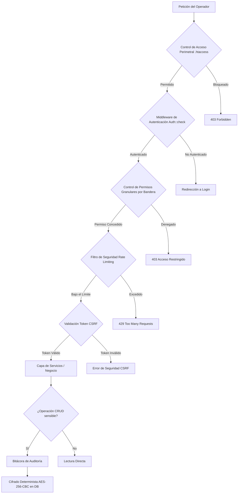

# Blueprint y Roadmap de Desarrollo: ERP Dirección de Registro Civil

Este documento sirve como hoja de ruta generalizada y plano de arquitectura de software para el ERP modular de la Dirección de Registro Civil. Su propósito es consolidar las decisiones de diseño, estándares de codificación, prácticas de seguridad y control de calidad implementados a lo largo del desarrollo, permitiendo su recreación exacta en futuros proyectos de nivel empresarial o en la plataforma de servicios Puvlika.

---

## 1. Patrón Arquitectónico y Estructura de Directorios

El sistema se basa en una arquitectura **MVC-like Modular y Autocontenida**, que aisla los componentes del sistema para facilitar el escalado y el mantenimiento.

### Estructura de Carpetas

```text
├── .agents/                    # Personalizaciones y reglas locales del agente
├── assets/                     # Recursos estáticos globales
│   ├── css/                    # Hojas de estilo (style.css principal)
│   └── js/                     # Scripts globales (global.js, bibliotecas)
├── cache/                      # Directorio de caché basado en archivos (Fallback de Redis)
├── core/                       # Núcleo de la aplicación (Capa de Infraestructura y Lógica Central)
│   ├── Services/               # Capa de Servicios de Negocio (Business Service Layer)
│   ├── Auth.php                # Gestión de autenticación y permisos
│   ├── Cache.php               # Gestor de caché unificado (Redis -> Filesystem)
│   ├── Catalogs.php            # Catálogos maestros cacheados
│   ├── Database.php            # Conexión Singleton PDO y generación transaccional de folios
│   ├── Encryption.php          # Criptografía AES-256-CBC Determinista
│   ├── RateLimiter.php         # Limitador de tasa de peticiones (Anti-scraping)
│   └── Utils.php               # Utilidades globales (cálculo de fechas de entrega, validadores)
├── docs/                       # Documentación técnica, esquemas SQL e históricos de planes
│   └── planes_implementacion/  # Registro histórico de las propuestas de arquitectura por fase
├── modules/                    # Módulos del Sistema (Estructura Modular Autocontenida)
│   ├── ciudadanos/             # Ejemplo: Catálogo Maestro de Ciudadanos
│   │   ├── create.php          # Formulario de alta
│   │   ├── data.php            # Endpoint JSON para procesamiento server-side de tablas
│   │   ├── delete.php          # Endpoint JSON para baja lógica (Soft Delete)
│   │   ├── edit.php            # Formulario de modificación
│   │   ├── index.php           # Vista principal del módulo (DataTable)
│   │   └── save.php            # Controlador de guardado (Recibe POST, sanitiza y delega a Servicios)
│   ├── nacimientos/            # Módulo de Nacimientos
│   ├── defunciones/            # Módulo de Defunciones
│   ├── inexistencias/          # Módulo de Constancias de Inexistencia
│   └── ... (otros módulos)     # Matrimonios, Divorcios, Reconocimientos, Inscripciones, Foráneas, Peticiones
├── public/                     # Punto de entrada público y archivos administrativos
│   ├── api/                    # Endpoints públicos o de analítica para widgets
│   ├── dashboard.php           # Panel principal con widgets y gráficos (Chart.js)
│   ├── login.php               # Formulario de inicio de sesión
│   └── usuarios.php            # Panel de gestión de usuarios y permisos
├── tests/                      # Suite de pruebas automatizadas
│   ├── Unit/                   # Pruebas unitarias de backend (PHPUnit)
│   └── e2e/                    # Pruebas de extremo a extremo (Playwright)
└── .env                        # Variables de entorno y llaves secretas de cifrado (Excluido de la raíz web)
```

> [!NOTE]
> **Modularidad Autocontenida:** Cada módulo dentro de `modules/` cuenta con sus propios scripts de visualización y controladores. Esto evita acoplar el código y permite que desarrolladores independientes trabajen en módulos diferentes sin colisionar en un mismo archivo controlador.

---

## 2. Parámetros de Arquitectura de Software (Replicables)

Para recrear esta arquitectura de manera consistente en otros productos, se deben implementar y respetar los siguientes 6 pilares:

### A. Catálogo Maestro y Consistencia de Identidad
*   **Fuente Única de Verdad (Single Source of Truth):** Se utiliza una tabla maestra centralizada de `ciudadanos` (ID, CURP cifrada, Nombre, Estado Vital).
*   **Vinculación Dinámica:** Los módulos de trámites (Nacimientos, Defunciones, etc.) no deben almacenar cadenas de texto con nombres de ciudadanos. En su lugar, se asocian mediante llaves foráneas a la tabla de ciudadanos mediante búsquedas dinámicas asíncronas (Select2/Tom Select) contra endpoints JSON.
*   **Integridad Lógica:** Se implementan reglas automatizadas en cascada en la capa de servicios (por ejemplo, registrar un acta de defunción cambia de manera automática e irreversible el estado vital del ciudadano a `FINADO` en la tabla maestra).

### B. Separación de Responsabilidades y Capa de Servicios (Service Layer)
*   **Controladores Flacos (`Thin Controllers`):** Los archivos de guardado (`save.php`) o endpoints se limitan exclusivamente a:
    1. Validar la sesión y permisos del usuario.
    2. Sanitizar las entradas del cliente.
    3. Validar tokens de seguridad (CSRF).
    4. Llamar al método correspondiente de la clase de servicio correspondiente y retornar la respuesta estructurada (JSON o Redirección).
*   **Clases de Servicio (`Business Services`):** Ubicadas en `core/Services/`, son las encargadas de ejecutar toda la lógica de negocio. Estas clases se autocargan mediante Composer (`PSR-4`) y encapsulan las consultas complejas, operaciones en base de datos y eventos de auditoría.
*   **Transaccionalidad Estricta:** Las acciones que involucren inserciones múltiples o actualizaciones lógicas ligadas en cascada deben envolverse obligatoriamente dentro de una transacción PDO (`beginTransaction()`, `commit()`, `rollBack()`).

### C. Soporte para Réplicas de Base de Datos (Read/Write Split)
*   **Escalabilidad en Lectura:** El núcleo de base de datos (`core/Database.php`) maneja conexiones duales:
    *   `getWriteConnection()`: Retorna la conexión principal (Master) para operaciones de inserción, actualización, eliminación o transacciones.
    *   `getReadConnection()`: Retorna una conexión a una base de datos secundaria (Slave/Réplica) para alimentar consultas pesadas de listado, filtros, generación de reportes y widgets analíticos.
*   **Fallback Automático:** Si no se declaran los parámetros de réplica en el archivo `.env`, `getReadConnection()` reutiliza de manera transparente la conexión principal, previniendo sobrecargas de sockets.

### D. Capa de Caché Unificada (Redis + Filesystem Fallback)
*   **Aceleración en RAM:** El sistema utiliza Redis (puerto 6379) para el almacenamiento llave-valor en memoria de consultas recurrentes y catálogos estáticos de baja mutabilidad (ej. Catálogo de Estados, Tipos de Trámite).
*   **Persistencia Local Alternativa:** Si el servidor de Redis no está disponible o la extensión de PHP no está instalada, el gestor de caché (`core/Cache.php`) realiza un fallback automático hacia archivos serializados en el directorio local `cache/`, manteniendo el rendimiento de la aplicación sin alterar el código del desarrollador.

### E. Estrategia de Calidad y Pruebas (QA)
*   **Pruebas Unitarias (PHPUnit):** Se implementan pruebas sobre clases de utilidades independientes y comportamientos del Core (tales como la validación de la estructura de líneas de pago, lógicas de conteo de días hábiles omitiendo fines de semana y consistencia del Singleton de base de datos).
*   **Pruebas de Extremo a Extremo (E2E Playwright):** Simulación automática del viaje del usuario en navegador web. Valida desde la pantalla de login, navegación interna, inserciones complejas que involucren ventanas modales y alertas SweetAlert2, garantizando la estabilidad de la UI ante refactorizaciones de backend.

### F. Estándares de Codificación y Diseño Limpio
*   **Mayúsculas en Base de Datos:** Todos los campos de texto correspondientes a nombres de personas, observaciones oficiales o nombres de estados se normalizan en **MAYÚSCULAS** a nivel de backend (`strtoupper`) y frontend (`text-transform: uppercase`).
*   **Tratamiento de Líneas de Pago y Controles:** Las líneas de pago y códigos de folios largos (17+ dígitos) se tratan y guardan estrictamente como cadenas de texto (`VARCHAR` / String), evitando que los motores de base de datos o herramientas de exportación (PhpSpreadsheet) los conviertan a notación científica o trunquen dígitos.

---

## 3. Parámetros de Seguridad y Buenas Prácticas

La seguridad del ERP está alineada con normativas gubernamentales para la protección de datos personales. Se debe recrear el siguiente esquema de protección:



### 1. Criptografía en Reposo (Cifrado Determinista AES-256-CBC)
*   **Propósito:** Salvaguardar datos personales sensibles (como la CURP) en la base de datos para mitigar fugas físicas de información.
*   **Mapeo Indexable:** Para permitir búsquedas rápidas (`SELECT WHERE curp = :curp`) sin desencriptar toda la base de datos en memoria, se utiliza un Vector de Inicialización (IV) **determinista** derivado de un hash seguro (HMAC-SHA-256) de los propios datos en texto plano combinado con la llave secreta del servidor.
*   **Integridad:** En la base de datos el campo se amplía a `VARCHAR(255)` debido a la expansión del cifrado en Base64. El backend se encarga de desencriptar los datos al vuelo para mostrarlos en la UI.

### 2. Limitación de Tasa (Rate Limiting)
*   **Defensa contra Scraping y Fuerza Bruta:** Implementado a nivel de API y endpoints críticos (búsqueda de ciudadanos y login).
*   **Esquema de Token Bucket/Ventana:** Rastrea la dirección IP del cliente a través de la capa de caché centralizada. Si el cliente excede el límite (ej. 30 consultas de búsqueda por minuto), el sistema bloquea inmediatamente la petición y responde con un código de estado `HTTP 429 Too Many Requests`.

### 3. Rotación Estricta de Identificadores de Sesión
*   **Mitigación de Fijación de Sesión (Session Hijacking):** PHP Sessions regeneran su identificador de cookies de manera inmediata mediante `session_regenerate_id(true)` en tres momentos críticos:
    1. Al iniciar sesión exitosamente.
    2. Al cambiar la propia contraseña del perfil de usuario.
    3. Cuando un administrador realiza cambios en el rol o permisos de un usuario que se encuentra activo en el sistema.

### 4. Protección contra Falsificación de Peticiones en Sitios Cruzados (CSRF)
*   **Tokens de Sesión Únicos:** Todo formulario de guardado o petición HTTP POST/DELETE asíncrona debe validar un token CSRF criptográfico almacenado en la sesión del usuario. Las peticiones sin token o con token alterado se cancelan inmediatamente antes de llegar a la capa de servicios.

### 5. Control de Acceso Perimetral y Aislamiento (.htaccess)
*   **Restricción del Servidor Web:** Configuración de directivas en Apache/Nginx para prohibir de forma tajante el acceso público vía HTTP a archivos del sistema sensibles:
    *   Archivos de configuración y entorno (`.env`, `.env.example`).
    *   Librerías de dependencias (`composer.json`, `composer.lock`, carpeta `vendor/`).
    *   El núcleo de la aplicación (bloquear indexación de la carpeta `core/`).
    *   Historiales y planes de implementación (`docs/`).

---

## 4. Guías de UI/UX y Diseño Web Moderno

Para asegurar una experiencia de usuario (UX) ágil y de alto rendimiento que reduzca la fatiga de los operadores de captura, se implementan las siguientes guías de interfaz:

### A. Tema de Color Corporativo y Modo Oscuro
*   **Identidad Visual:** Esquema de color institucional basado en Guinda/Vino y Dorado sobre fondos limpios.
*   **Prevención de Destello Blanco (FOUC):** Para evitar el molesto destello de luz clara al recargar la página cuando se tiene el modo oscuro activado, se inyecta un micro-bloque de Javascript en el `<head>` de forma inmediata para forzar la clase `.dark-mode` antes de renderizar el cuerpo del documento:
    ```html
    <script>if(localStorage.getItem('theme')==='dark'){document.documentElement.classList.add('dark-mode');}</script>
    ```
*   **Integración Completa de Componentes:** Las interfaces de Tom Select, DataTables y SweetAlert2 deben heredar y adaptarse dinámicamente a las variables de color del tema oscuro (`--bg-light`, `--text-color`, `--card-bg`, etc.).

### B. Formulario Interactivo y Agilidad en Captura (Keyboard-First)
*   **Navegación por Enter:** En formularios de captura, presionar la tecla `Enter` en cualquier input o control de selección enfoca de forma automática al siguiente campo visible e interactivo, agilizando el llenado sin usar el mouse. (Se excluyen de esta regla botones y áreas de texto multitexto).
*   **Guardado Rápido:** Presionar `Ctrl + Enter` (o `Cmd + Enter` en macOS) desde cualquier parte del formulario activo realiza de forma segura el envío y guardado de datos.
*   **Entradas Táctiles Contextuales:** Configuración rigurosa de atributos HTML5 en inputs para desplegar el teclado correspondiente en pantallas táctiles (ej. `inputmode="numeric"` para números de pago o folios, `type="email"` para correos).

### C. Retroalimentación Visual y Fluidez (PWA-Like)
*   **Pantallas Esqueleto (Skeleton Screens):** En lugar de cargadores giratorios (`spinners`) que bloquean la vista, se utilizan bloques con gradiente shimmer en movimiento para simular la estructura de los datos (tablas o widgets de dashboard) mientras las llamadas AJAX del cliente resuelven la información.
*   **Cero Recargas Innecesarias:** Las operaciones de creación rápida o altas secundarias se realizan mediante ventanas modales que procesan la petición por AJAX. Tras confirmarse el éxito, la DataTable se actualiza al vuelo (`table.ajax.reload(null, false)`) manteniendo la posición y filtros activos del operador.
*   **Notificaciones No Intrusivas (Toasts):** Reemplazo de modales SweetAlert2 bloqueantes por notificaciones Toast que se posicionan en la esquina superior derecha y desaparecen a los 3 segundos de forma automática.

### D. Optimización Móvil Crítica y Rendimiento de Recursos
*   **Evitar la Trampa del Estado "Hover":** En dispositivos móviles no existe la interacción de pasar el cursor por encima (hover). Las acciones críticas por fila (ej. Editar/Borrar) nunca deben ser ocultadas tras estados `:hover` en CSS. En interfaces móviles, estas acciones deben ser persistentes y visibles por defecto, o agrupadas bajo un menú interactivo permanente (como un icono de tres puntos verticales o menú hamburguesa de fila).
*   **Mitigación de Modales Largos (Scroll Infinito):** El uso de ventanas modales extensas en pantallas pequeñas confunde al usuario, quien no distingue si el scroll se realiza sobre la ventana emergente o sobre la página de fondo. Se debe preferir el uso de componentes Offcanvas inferiores (*bottom drawers*) autocontenidos para formularios o consultas secundarias en versión móvil, limitando el scroll al propio contenedor.
*   **Optimización del Peso de Librerías (Rendimiento de Carga):** Para garantizar un tiempo de carga rápido en dispositivos móviles bajo redes móviles limitadas (3G/4G):
    *   Cargar únicamente las hojas de estilo (CSS) críticas y minificadas en el `<head>`.
    *   Mover y posicionar la carga de scripts pesados (`.js` de Bootstrap, FontAwesome, DataTables, SweetAlert2 y Chart.js) al final del documento (justo antes del cierre de `</body>`) o utilizar el atributo `defer`.
    *   Para desarrollos escalados, implementar un empaquetador moderno como Vite o Webpack que realice minificación, compresión y *tree-shaking* (eliminación de código no utilizado) de las librerías.

---

## 5. Cronología de Fases de Desarrollo

A continuación se listan las fases completadas en la evolución del ERP de la Dirección de Registro Civil, las cuales han sido probadas y refinadas:

### 🟢 Fase 1: Arquitectura Base y Módulo Inicial (Completado)
*   Establecimiento del esqueleto de directorios modular y ruteos relativos.
*   Inicialización de conexión segura PDO y manejo de transacciones nativas.
*   Creación del sistema de autenticación seguro basado en sesiones PHP.
*   Implementación del primer submódulo de Inexistencias y exportación nativa a Excel respetando plantillas institucionales con `PhpSpreadsheet`.

### 🟢 Fase 2: Expansión Modular y Padrón Central (Completado)
*   Despliegue de los módulos de Nacimientos, Defunciones, Matrimonios, Divorcios, Reconocimientos e Inscripciones.
*   Implementación del Catálogo Único de Ciudadanos y enlace dinámico de búsquedas mediante AJAX.

### 🟢 Fase 3: Trámites Especiales y Peticiones (Completado)
*   Creación del módulo de recepción de Actas Foráneas y mesa de soporte técnico mediante tickets alfanuméricos.
*   Dashboard inicial con gráficos analíticos dinámicos basados en `Chart.js`.

### 🟢 Fase 4: Responsividad Extrema y UX PWA-Like (Completado)
*   Soporte completo para dispositivos móviles (Offcanvas Menus, DataTables Responsivas, etc.).
*   Implementación de modales de inserción AJAX y notificaciones flotantes de tipo Toast en toda la suite.

### 🟢 Fase 5: Expansión de Módulos y Roles Granulares (Completado)
*   Control de acceso ultra-fino a través de 11 permisos booleanos individuales en la base de datos por operador.
*   Panel interactivo de administración de usuarios para asignación dinámica de permisos.

### 🟢 Fase 6: Seguridad, Auditoría y Reglas de Negocio (Completado)
*   Instalación de la bitácora de auditoría global (`bitacora_auditoria`) para rastreo detallado de operaciones de usuario (INSERT, UPDATE, DELETE).
*   Reglas lógicas de validación cruzada y sincronización vital automatizada.

### 🟢 Fase 10: Optimización, Soft Deletes e Inclusión .env (Completado)
*   Instalación de índices de rendimiento explícitos en columnas de alta demanda (`curp`, `nombre`).
*   Configuración del campo `estado` en la tabla de ciudadanos para implementar bajas lógicas (Soft Deletes).
*   Aislamiento web de archivos sensibles mediante reglas en `.htaccess`.

### 🟢 Fase 11: Arquitectura de Servicios y Réplicas (Completado)
*   Migración de lógicas de negocio de los controladores a clases autocargadas de servicios en `core/Services/`.
*   Implementación de la capa de caché de catálogos mediante Redis con fallback automatizado a disco.
*   Creación de división de base de datos para soporte Master/Slave (Read/Write Split).

### 🟢 Fase 12: Seguridad Avanzada y Criptografía (Completado)
*   Encriptación AES-256-CBC Determinista de CURPs para indexación y búsquedas exactas directas en base de datos.
*   Limitadores de tasa (Rate Limiting) en las APIs para prevención de raspado masivo de datos.
*   Rotación forzada de IDs de sesión de usuario ante eventos de cambio de perfil o estatus de permisos.

### 🟢 Fase 13: Aseguramiento de Calidad y Pruebas (Completado)
*   Montaje de suites de pruebas unitarias backend con PHPUnit.
*   Montaje de suite de pruebas de flujo UI de extremo a extremo (E2E) con Playwright.

### 🟢 Fase 14: UI/UX Avanzado (Completado)
*   Integración del toggle de modo oscuro con persistencia y prevención de flash de color claro (FOUC).
*   Integración de navegación y envío rápido de formularios por teclado (Enter / Ctrl+Enter).
*   Esqueletos de carga shimmer en dashboards y tablas.

### 🟢 Fase 15: Filtros Avanzados y Reportes (Completado)
*   Herramientas avanzadas de búsqueda y multi-filtrado para reportes gerenciales.
*   Exportación optimizada multi-formato.

### 🟢 Fase 17: Optimización de Formularios (Completado)
*   Refactorizaciones de interactividad y autocompletados en formularios complejos de registro civil.

### 🟢 Fase 18: Responsividad de Rendimiento (Completado)
*   Eliminación de llamadas síncronas pesadas restantes y migración completa del flujo de guardado a Toasts y Modales AJAX.

---

## 6. Próximos Pasos y Evolución (Hacia Puvlika)

Para proyectos futuros que utilicen este Blueprint, se planifican los siguientes hitos de automatización y despliegue:

*   **Integración Continua (CI/CD):** Creación de pipelines automáticos en GitHub Actions para validar estándares PSR-12, análisis estático de tipos con PHPStan y ejecución automática de PHPUnit y Playwright ante cualquier cambio (Push/PR).
*   **Emisión con Firma y QR:** Integración de bibliotecas de generación PDF protegidas, incluyendo marcas de agua digitales, firmas electrónicas simplificadas y códigos QR de verificación para validez oficial externa de constancias y actas.
*   **Monitoreo y Observabilidad en Caliente:** Integración de herramientas de tracking de excepciones en producción (como Sentry o Monolog estructurado) para alertar al equipo de TI ante errores críticos antes de que afecten a los operadores.