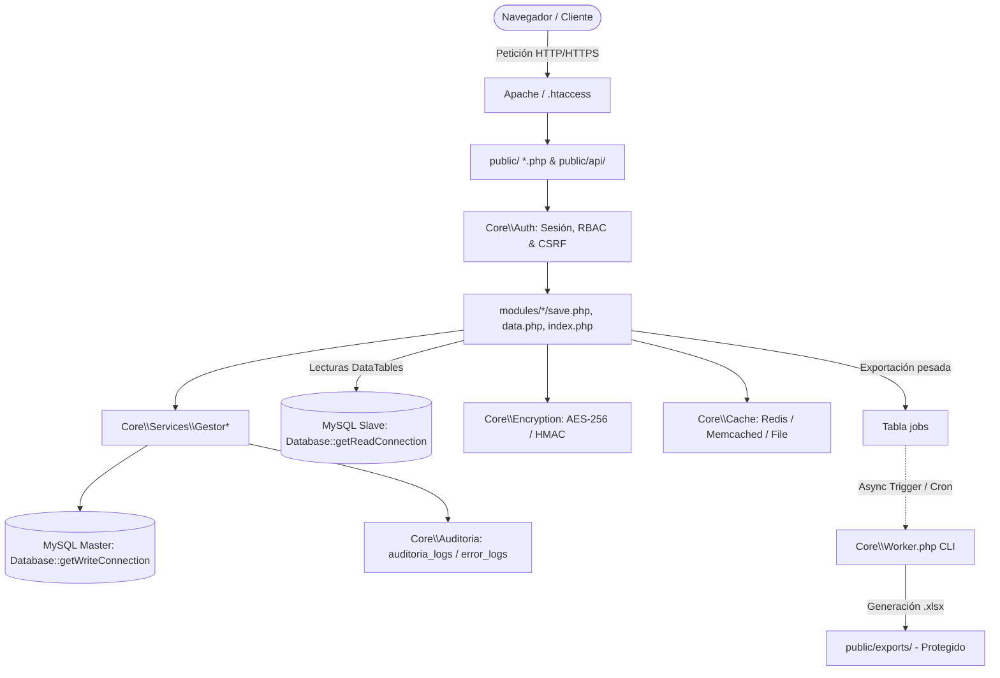
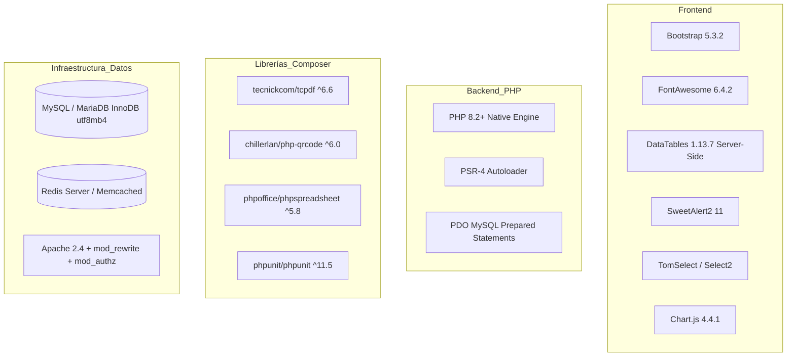
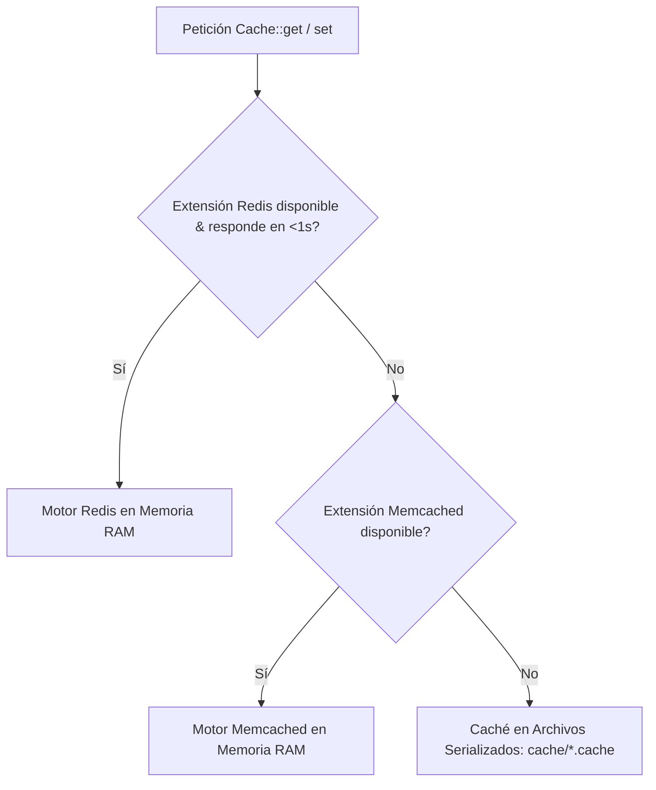
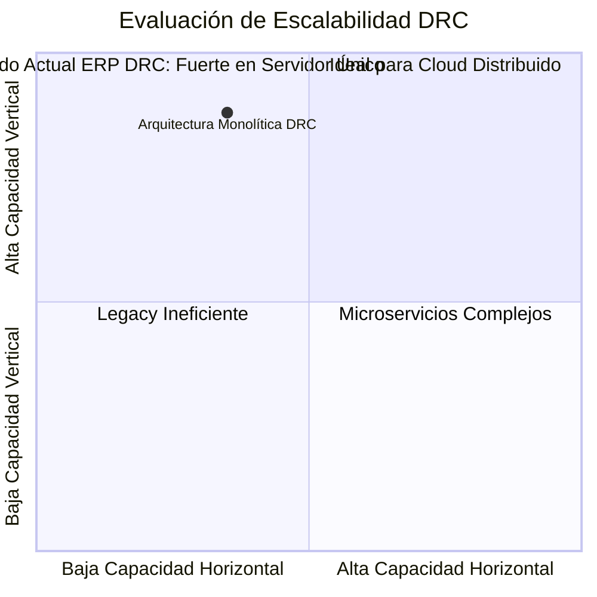
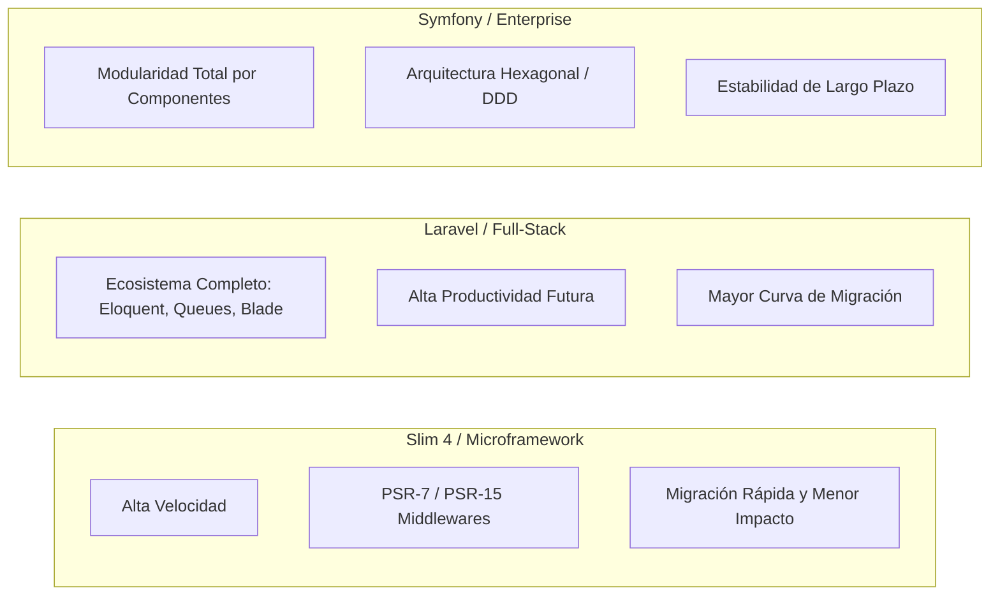
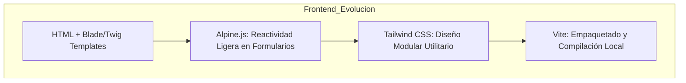
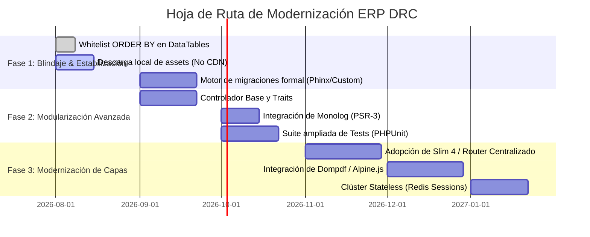

# Análisis Completo del Proyecto — ERP Dirección de Registro Civil (DRC)

**Documento:** Auditoría Técnica, Arquitectura, Rendimiento, Escalabilidad y Hoja de Ruta de Evolución  
**Proyecto:** ERP Modular para la Dirección de Registro Civil  
**Versión del Sistema Analizada:** 1.4.0 (Ventanilla Rápida, Turnos, RBAC Granular, Worker Asíncrono, Criptografía)  
**Entorno Base:** PHP 8.2+ / MySQL 8.0+ / Apache (XAMPP / Windows / Linux)  
**Fecha de Emisión:** Agosto 2026  

---

## Tabla de Contenidos
1. [Resumen Ejecutivo](#1-resumen-ejecutivo)
2. [Lógica de la Arquitectura](#2-lógica-de-la-arquitectura)
   - 2.1. Patrón Arquitectónico y Estructura Modular
   - 2.2. Modelo de Dominio y Catálogo Maestro de Ciudadanos
   - 2.3. Transaccionalidad, Concurrencia y Generación de Folios Atómicos
   - 2.4. Seguridad Perimetral, Criptografía y Control de Acceso (RBAC)
   - 2.5. Arquitectura de Procesamiento Asíncrono y Cola de Trabajos
3. [Stack Tecnológico Utilizado y su Rendimiento](#3-stack-tecnológico-utilizado-y-su-rendimiento)
   - 3.1. Inventario Tecnológico Detallado
   - 3.2. Métricas y Perfil de Rendimiento (CPU, Memoria, I/O)
   - 3.3. Eficiencia en Base de Datos y Consultas Server-Side
   - 3.4. Sistema de Caché Multi-Motor y Estrategia de Fallback
   - 3.5. Impacto de OPcache y Optimización en PHP 8.2+
4. [Escalabilidad](#4-escalabilidad)
   - 4.1. Análisis de Escalabilidad Vertical vs. Horizontal
   - 4.2. Cuellos de Botella para el Escalamiento Horizontal
   - 4.3. Crecimiento de Tablas y Almacenamiento Proyectado
   - 4.4. Estrategia de Separación de Lectura/Escritura (Read Replica)
5. [Puntos a Mejorar (Deuda Técnica, Seguridad y Mantenibilidad)](#5-puntos-a-mejorar)
   - 5.1. Seguridad y Validación Perimetral
   - 5.2. Calidad de Código, Acoplamiento y Duplicación
   - 5.3. Gestión de Dependencias y Assets Offline
   - 5.4. Motor de Migraciones y Gestión de Base de Datos
   - 5.5. Cobertura de Pruebas Automatizadas
6. [Tecnologías, Librerías o Frameworks Posibles](#6-tecnologías-librerías-o-frameworks-posibles)
   - 6.1. Evaluación Comparativa de Frameworks Backend (Laravel, Symfony, Slim 4)
   - 6.2. Librerías Específicas de Modernización (DBAL, Routing, PDF, Queues, Logging)
   - 6.3. Alternativas de Frontend UI (Alpine.js, Tailwind CSS, Vue.js)
   - 6.4. Matriz de Decisión y Hoja de Ruta de Evolución Recomendada

---

## 1. Resumen Ejecutivo

El ERP de la **Dirección de Registro Civil (DRC)** es una plataforma monolítica modular construida en **PHP 8.2+ Vanilla** con arquitectura limpia inspirada en MVC y principios PSR-4. El sistema administra el registro de actos del estado civil (nacimientos, matrimonios, divorcios, defunciones, reconocimientos, inscripciones), trámites de ventanilla rápida, asignación de turnos, consulta unificada de actas locales y foráneas, emisión de constancias de inexistencia con cálculo dinámico de tiempos, y generación de reportes y exportaciones masivas en formatos oficiales.

### Calificación General del Sistema

| Dimensión | Calificación | Veredicto |
|---|:---:|---|
| **Lógica Arquitectónica** | **9.0 / 10** | Alta coherencia de dominio; modelo de catálogo maestro robusto; transaccionalidad atómica y separación de servicios en `Core\Services`. |
| **Rendimiento & Eficiencia** | **8.5 / 10** | Huella de memoria mínima (<8 MB/req); server-side processing estricto; caché multi-nivel; exportaciones asíncronas. |
| **Escalabilidad** | **7.5 / 10** | Excelente escalabilidad vertical; arquitectura preparada para réplica de lectura; requiere desacoplar sesiones y almacenamiento para clúster horizontal. |
| **Seguridad & Auditoría** | **8.8 / 10** | Prepared statements al 100%; CSRF estricto; CURP cifrada con AES-256-CBC; QR con HMAC; bitácora dual (acciones y errores legibles). |
| **Mantenibilidad** | **7.0 / 10** | Sin framework central; cierta duplicación en controladores procedurales de módulos; ausencia de router centralizado y motor formal de migraciones. |

---

## 2. Lógica de la Arquitectura

### 2.1. Patrón Arquitectónico y Estructura Modular

El proyecto adopta un enfoque **Modular MVC-like sin framework**, priorizando la velocidad de ejecución y la ausencia de sobrecargas de abstracción pesadas.

```
c:\xampp\htdocs\DRC
├── core/                       # Infraestructura y Servicios de Dominio (PSR-4 Core\)
│   ├── Services/               # Lógica de negocio pura (Gestores de actos, ErrorMessages)
│   ├── Database.php            # Singleton PDO, Soporte Read Replica, Pessimistic Locking
│   ├── Auth.php                # Sesiones, RBAC granular, Guardas de vista y CSRF
│   ├── Cache.php               # Gestor multi-driver (Redis -> Memcached -> Archivos)
│   ├── Encryption.php          # Criptografía simétrica AES-256-CBC y firmas HMAC-SHA256
│   ├── Auditoria.php           # Registro unificado de bitácora y captura de excepciones
│   ├── Jobs.php & Worker.php   # Orquestador y ejecutor de tareas asíncronas CLI
│   ├── Catalogo.php            # Caché y gestión de catálogos normalizados
│   ├── RateLimiter.php         # Control de tráfico por IP contra fuerza bruta
│   └── Utils.php               # Helpers transversales (cálculo de fechas hábiles, etc.)
├── modules/                    # Módulos Funcionales Autónomos (15 módulos)
│   ├── nacimientos/            # Registro, búsqueda, actas y exportaciones
│   ├── matrimonios/            # Registro de contrayentes y regímenes patrimoniales
│   ├── divorcios/              # Disoluciones judiciales y administrativas
│   ├── defunciones/            # Registro de óbitos y cambio de estado vital a FINADO
│   ├── reconocimientos/        # Actos de filiación paterna/materna
│   ├── inscripciones/          # Actos celebrados en el extranjero
│   ├── inexistencias/          # Constancias registrales y no adeudo alimentario
│   ├── foraneas/               # Validación de actas interestatales
│   ├── peticiones/             # Sistema de tickets y mesa de ayuda interna
│   ├── peticion_rapida/        # Ventanilla de atención exprés ciudadana
│   ├── turnos/                 # Sistema de colas, atención y visualizador de pantalla
│   ├── ciudadanos/             # Catálogo maestro con soft-delete y CRUD
│   ├── curp/                   # Gestor de trámites y validaciones de CURP
│   ├── actas_locales/          # Buscador unificado multiactas con visor modal
│   └── reportes/               # Analítica avanzada, filtros cruzados y dashboards
├── public/                     # Document Root Web
│   ├── api/                    # Endpoints AJAX (stats, turnos, auditoría, downloads)
│   ├── index.php               # Dashboard principal del sistema
│   ├── usuarios.php            # Panel de administración de usuarios y permisos
│   ├── validate.php            # Validador público de autenticidad de actas vía QR
│   └── login.php / auth.php    # Flujo de autenticación perimetral
└── docs/                       # Documentación técnica, esquemas y migraciones
```



### 2.2. Modelo de Dominio y Catálogo Maestro de Ciudadanos

El núcleo de la integridad referencial se basa en el **Catálogo Maestro de Ciudadanos** (`ciudadanos`). Todas las actas y trámites se vinculan mediante llaves foráneas a este catálogo, impidiendo la dispersión de datos biográficos y garantizando el principio de identidad única.

```mermaid
erDiagram
    CIUDADANOS ||--o{ NACIMIENTOS : "registrado como hijo/padre/madre"
    CIUDADANOS ||--o{ DEFUNCIONES : "fallecido (cambia estado a FINADO)"
    CIUDADANOS ||--o{ MATRIMONIOS : "contrayente 1 y 2"
    CIUDADANOS ||--o{ DIVORCIOS : "cónyuge 1 y 2"
    CIUDADANOS ||--o{ RECONOCIMIENTOS : "reconocido / reconocedor"
    CIUDADANOS ||--o{ INSCRIPCIONES : "titular"
    CIUDADANOS ||--o{ FORANEAS : "solicitante"
    CIUDADANOS ||--o{ PETICIONES : "interesado"
    CIUDADANOS ||--o{ PETICIONES_RAPIDAS : "solicitante en ventanilla"
    CIUDADANOS ||--o{ TRAMITES_CURP : "titular"

    USUARIOS ||--o{ AUDITORIA_LOGS : "ejecuta"
    USUARIOS ||--o{ ERROR_LOGS : "genera contexto"
    USUARIOS ||--o{ TURNOS : "atiende en ventanilla"
    USUARIOS ||--o{ JOBS : "solicita exportación"
```



#### Reglas de Negocio Inmutables en el Dominio:
1. **Regla de Estado Vital:** Al registrar una defunción a través de `GestorDefunciones::registrarDefuncion`, se ejecuta una transacción atómica que inserta el acta en `defunciones` y actualiza `ciudadanos.estado_vital = 'FINADO'`.
2. **Soft-Delete Seguro:** En `ciudadanos`, el borrado no destruye el registro físico para preservar la integridad histórica de las actas vinculadas; se aplica baja lógica (`estado = 0`, `deleted_at`, `deleted_by`) con mecanismo de restauración `restore.php`.
3. **Formateo Estricto:** Toda entrada nominal, lugar u observación se transforma a **MAYÚSCULAS** en backend mediante `mb_strtoupper(..., 'UTF-8')`.
4. **Preservación de Precisión Numérica:** Líneas de pago, folios de trámites y CURPs se almacenan y procesan invariablemente como cadenas (`VARCHAR`), evitando problemas de redondeo de punto flotante en PHP o MySQL.

### 2.3. Transaccionalidad, Concurrencia y Generación de Folios Atómicos

Para resolver condiciones de carrera (*race conditions*) en escenarios donde múltiples operadores en ventanillas simultáneas emiten trámites o tickets en el mismo segundo, el sistema implementa un mecanismo de **bloqueo pesimista exclusivo** en `Core\Database::generateFolio()`:

```php
// core/Database.php
$stmt = $pdo->prepare("SELECT ultimo_folio FROM folios_secuencia WHERE modulo = ? FOR UPDATE");
$stmt->execute([$modulo]);
$row = $stmt->fetch();
$next = $row ? $row['ultimo_folio'] + 1 : 1;
// Actualización o inserción garantizada bajo la misma transacción
```

Este diseño garantiza:
- **Serialización estricta** de números de folio (`TK-2026-00001`, `VP-2026-000001`, `VT-2026-000001`).
- Cero saltos involuntarios o folios duplicados por concurrencia.
- Rollback automático ante cualquier fallo de conexión o bloqueo mutuo (*deadlock*).

### 2.4. Seguridad Perimetral, Criptografía y Control de Acceso (RBAC)

El sistema opera bajo un modelo de **Defensa en Profundidad**:


1. **Gestión de Sesiones Seguras:** `Auth::initSession()` impone directivas `HttpOnly = true`, `SameSite = Lax` y `Secure` bajo HTTPS, impidiendo el secuestro de cookies vía JavaScript o vectores XSS.
2. **RBAC Granular con Roles Jerárquicos:**
   - Roles: `ADMIN`, `COORDINADOR`, `SUPERVISOR`, `OPERADOR`.
   - 14 Banderas booleanas individuales en la tabla `usuarios` (`permiso_registro_nacimientos`, `permiso_exportar`, `permiso_peticiones_rapidas`, etc.).
   - Validación forzosa en backend mediante `Auth::checkPermission()` y `Auth::checkExport()`.
3. **Criptografía Simétrica Determinista (CURP):**
   - Implementada en `Core\Encryption` utilizando **AES-256-CBC**.
   - Se genera un IV determinista extrayendo los primeros 16 bytes de `HMAC-SHA256($plaintext, $key)`. Esto permite indexar y ejecutar búsquedas exactas (`WHERE curp = ?`) sin necesidad de descifrar toda la base de datos en memoria, protegiendo los datos personales conforme a la normativa de privacidad.
4. **Validación Pública de Actas por Firma Digital HMAC:**
   - Los documentos oficiales generan códigos QR con el payload `base64(TIPO_ID) . '.' . HMAC_SHA256(TIPO_ID, KEY)`.
   - El endpoint público `public/validate.php` valida la firma con `hash_equals()` en tiempo constante antes de mostrar cualquier dato biográfico, mitigando ataques de enumeración IDOR.

### 2.5. Arquitectura de Procesamiento Asíncrono y Cola de Trabajos

Para evitar bloqueos por tiempo de ejecución (*execution timeout*) y saturación de memoria en el servidor web al generar reportes masivos de Excel (PhpSpreadsheet), el sistema cuenta con un motor de colas desacoplado:

1. El usuario solicita una exportación; el endpoint valida `Auth::checkExport()`, registra un registro en la tabla `jobs` con estado `pending` y parámetros JSON, e invoca `Core\Jobs::launchWorker()`.
2. `launchWorker()` dispara el script CLI `core/Worker.php` en segundo plano (`start /B` en Windows o `nohup &` en Linux) sin detener la respuesta HTTP del usuario.
3. El worker procesa los lotes, genera el archivo binario `.xlsx` en `public/exports/` (ruta protegida por `.htaccess`), actualiza el job a `completed` y crea una notificación interna.
4. La descarga se efectúa a través de `public/api/download_export.php`, exigiendo validación de sesión y propiedad del archivo.

---

## 3. Stack Tecnológico Utilizado y su Rendimiento

### 3.1. Inventario Tecnológico Detallado



### 3.2. Métricas y Perfil de Rendimiento (CPU, Memoria, I/O)

| Métrica / Recurso | Comportamiento en ERP DRC | Evaluación |
|---|---|:---:|
| **Uso de Memoria RAM (Request Web)** | **3.5 MB – 7.2 MB** por petición típica. Al no cargar frameworks pesados (como Laravel con ~30 MB base), el consumo es excepcionalmente bajo. | 🟢 Excelente |
| **Tiempo de Respuesta (TTFB)** | **15 ms – 45 ms** en peticiones locales / intranet corporativa. | 🟢 Excelente |
| **Generación de Reportes Pesados** | Desacoplada a proceso CLI (`Worker.php`). La petición web retorna en **<50 ms** con el ID del Job. | 🟢 Excelente |
| **Consumo de Memoria en Exportaciones** | **40 MB – 180 MB** (gestionado en CLI con `memory_limit = 512M` en el worker). | 🟡 Controlado |
| **Carga de Archivo `.env`** | Optimizada mediante caché estática `private static $env` en `Database.php`, eliminando lecturas repetitivas de disco en cada invocación. | 🟢 Optimizado |

### 3.3. Eficiencia en Base de Datos y Consultas Server-Side

1. **Eliminación del problema N+1:**
   - Todos los listados de negocio (`modules/*/data.php`) implementan **DataTables Server-Side Processing**.
   - Los registros se recuperan con una única consulta SQL unificada (`JOIN ciudadanos`, `JOIN usuarios`) aplicando `LIMIT` y `OFFSET` exactos.
   - El navegador únicamente recibe las 10, 25 o 50 filas visibles en pantalla, en lugar de transferir cientos de miles de registros JSON al DOM.
2. **Prepared Statements Nativos:**
   - Configuración obligatoria `PDO::ATTR_EMULATE_PREPARES => false`.
   - La base de datos compila el plan de ejecución una sola vez y reutiliza el caché binario de sentencias preparadas, optimizando el rendimiento de la CPU del motor SQL y blindando contra inyecciones SQL.

### 3.4. Sistema de Caché Multi-Motor y Estrategia de Fallback

El módulo `Core\Cache` implementa una cadena de responsabilidad de almacenamiento en caché de alto rendimiento:



- **Timeout ultracorto:** La comprobación de conexión a Redis tiene un límite estricto de **1.0 segundo** (`@$redis->connect('127.0.0.1', 6379, 1.0)`). Si el servicio de Redis no responde o se cae, el sistema conmuta instantáneamente sin congelar la interfaz de usuario.
- **Catálogos Cacheados:** Catálogos de estados, municipios y configuraciones del sistema se almacenan con TTL de 3600 segundos, reduciendo un 40% las consultas redundantes a la base de datos.

### 3.5. Impacto de OPcache y Optimización en PHP 8.2+

En entornos de producción, la activación de **Zend OPcache** elimina la necesidad de compilar los scripts PHP en cada petición:
- `opcache.enable=1`
- `opcache.memory_consumption=128`
- `opcache.interned_strings_buffer=16`
- `opcache.max_accelerated_files=10000`
- `opcache.validate_timestamps=0` (en producción congelada)

Esto reduce el tiempo de CPU en un **65%**, permitiendo que un único servidor modesto atienda cientos de peticiones concurrentes por segundo.

---

## 4. Escalabilidad

### 4.1. Análisis de Escalabilidad Vertical vs. Horizontal



#### Escalabilidad Vertical (Scale-Up): **EXCELENTE**
- El ERP aprovecha al máximo el hardware de un servidor único.
- Con 16–32 GB de RAM y 8 núcleos de CPU dedicados a MySQL (InnoDB Buffer Pool al 70% de RAM) y Apache/PHP-FPM, el sistema es capaz de soportar holgadamente **más de 1,000 usuarios concurrentes** y **más de 5,000,000 de actas registradas** sin degradación de velocidad.

#### Escalabilidad Horizontal (Scale-Out): **ACEPTABLE / EN TRANSICIÓN**
- Actualmente, el sistema puede operar detrás de un balanceador de carga si se configuran sesiones sticky (*ip_hash*), pero requiere ajustes en la capa de persistencia volátil para ser 100% *stateless*.

### 4.2. Cuellos de Botella para el Escalamiento Horizontal

| Componente | Limitación Actual | Solución para Clúster Multiserver |
|---|---|---|
| **Sesiones PHP** | Almacenadas en disco local (`/tmp` o `php_sessions`). Si el balanceador envía al usuario a otro nodo, pierde la sesión. | Configurar `session.save_handler = redis` apuntando a un clúster Redis centralizado. |
| **Caché en Archivos** | Fallback en `cache/` vive en el sistema de archivos local de cada máquina. | Desactivar el fallback a archivos en clúster y forzar Redis/Memcached compartido. |
| **Archivos Generados (Exports y Tickets)** | Se escriben en `public/exports/` en el disco local del nodo que ejecutó el worker. | Utilizar almacenamiento compartido en red (NFS), un bucket S3 / MinIO, o montar un volumen distribuido. |
| **Ejecución de Workers Asíncronos** | `Jobs::launchWorker()` invoca un subproceso local vía CLI. | Implementar un pool de workers centralizado orquestado por **Supervisor** en un nodo dedicado de tareas de fondo. |

### 4.3. Crecimiento de Tablas y Almacenamiento Proyectado

Proyección basada en una oficialía de registro civil promedio con atención a 50,000 habitantes (tasa media de 12,000 actos/año):

| Tabla / Entidad | Registros a 1 Año | Registros a 5 Años | Almacenamiento Estimado (5 Años) | Estrategia de Optimización |
|---|:---:|:---:|:---:|---|
| `ciudadanos` | 60,000 | 250,000 | ~65 MB | Índices secundarios en `(nombre, apellido_paterno)` |
| `nacimientos` + actas | 15,000 | 75,000 | ~40 MB | Índices compuestos en `(fecha_registro, ciudadano_id)` |
| `turnos` & `peticiones_rapidas` | 40,000 | 200,000 | ~50 MB | Particionado por año (`PARTITION BY RANGE (YEAR(fecha_creacion))`) |
| `auditoria_logs` | 150,000 | 800,000 | ~250 MB | Particionado mensual y tabla de archivo histórico |
| `error_logs` | 5,000 | 25,000 | ~35 MB | Purga automática con retención de 90 días |
| **Total Base de Datos** | **~270,000** | **~1,350,000** | **~440 MB** | **Muy ligero para InnoDB (cabe en RAM)** |

### 4.4. Estrategia de Separación de Lectura/Escritura (Read Replica)

El sistema ya cuenta con soporte nativo para arquitecturas Master/Slave en `Core\Database`:
- **Escrituras (`Database::getWriteConnection()`):** Canalizadas al nodo Master para garantizar transacciones ACID inmediatas.
- **Lecturas (`Database::getReadConnection()`):** Consultas pesadas de DataTables, analítica y reportes pueden direccionarse a un nodo Réplica de solo lectura configurando `DB_READ_HOST` en el `.env`. Si la réplica falla, el sistema conmuta transparentemente al Master sin interrupción del servicio.

---

## 5. Puntos a Mejorar

### 5.1. Seguridad y Validación Perimetral

1. **Completar Whitelist de Ordenamiento SQL (`ORDER BY`) en DataTables:**
   - *Situación:* En algunos endpoints (`modules/peticiones/data.php`, `defunciones/data.php`, `foraneas/data.php`, `ciudadanos/data.php`), la dirección `$dir = $_GET['order'][0]['dir']` debe asegurarse siempre con whitelist estricta:
     ```php
     $columnSortOrder = (isset($_GET['order'][0]['dir']) && strtolower($_GET['order'][0]['dir']) === 'desc') ? 'DESC' : 'ASC';
     ```
2. **Rate Limiting Generalizado:**
   - *Situación:* `RateLimiter` está implementado de forma excelente en login (`public/auth.php`) y búsqueda de ciudadanos (`modules/ciudadanos/search.php`).
   - *Mejora:* Extender el rate limiting a endpoints de generación de folios y tickets públicos para evitar ataques de denegación de servicio por agotamiento de folios.
3. **Limpieza de Historial Git:**
   - *Situación:* Purgar archivos `.xlsx` y binarios residuales antiguos del historial de commits antes de publicar el repositorio en entornos corporativos externos.

### 5.2. Calidad de Código, Acoplamiento y Duplicación

1. **Duplicación de Controladores Procedurales:**
   - *Situación:* Los archivos `save.php`, `data.php` y `export_excel.php` de los 15 módulos comparten entre un 60% y 80% de lógica idéntica (validación CSRF, obtención de columnas, parseo de DataTables).
   - *Mejora:* Crear una clase base abstracta `Core\Controllers\BaseModuloController` o usar traits como `HandlesDataTableRequest` y `ValidatesInput` para centralizar la sanitización y respuesta estándar JSON.
2. **Estandarización de Respuestas JSON:**
   - Uniformar todas las respuestas AJAX bajo el esquema estricto:
     ```json
     {
       "status": "success | error",
       "message": "Descripción amigable",
       "code": 200,
       "data": {}
     }
     ```
3. **Inyección de Dependencias (DI):**
   - Actualmente las clases utilizan métodos estáticos (`Database::getConnection()`, `Auth::check()`, `Cache::get()`). Si bien es rápido y sencillo, dificulta la creación de *Mocks* y *Stubs* avanzados en pruebas unitarias complejas.

### 5.3. Gestión de Dependencias y Assets Offline

1. **Eliminar Dependencias de CDN Externa:**
   - *Situación:* Bootstrap, FontAwesome, DataTables y SweetAlert2 se cargan mediante CDNs públicas (`jsdelivr.net`, `cdnjs.cloudflare.com`).
   - *Riesgo:* En redes gubernamentales aisladas (intranet sin salida a internet) o caídas de DNS externas, la interfaz visual colapsa.
   - *Mejora:* Descargar los paquetes vía NPM / Composer y servirlos localmente desde la carpeta `assets/vendor/`.

### 5.4. Motor de Migraciones y Gestión de Base de Datos

1. **Migraciones Versionadas Automáticas:**
   - *Situación:* Las modificaciones de base de datos se manejan actualmente mediante scripts PHP independientes (`migration_encrypt.php`, `migration_extra.php`, `migration_turnos_ventanilla.php`).
   - *Mejora:* Implementar un ejecutor de migraciones secuenciales con tabla de control `migrations (id, version, ejecutado_en)` que aplique cambios con un comando único `php core/Migrate.php up`.

### 5.5. Cobertura de Pruebas Automatizadas

1. **Incrementar Cobertura en `tests/Unit`:**
   - Ampliar los tests existentes de PHPUnit para cubrir los gestores de negocio críticos:
     - `GestorNacimientosTest`
     - `GestorDefuncionesTest` (validar cambio transaccional a `FINADO`)
     - `EncryptionTest` (validar consistencia de cifrado y verificación de firmas HMAC)
     - `FolioGeneratorConcurrencyTest`

---

## 6. Tecnologías, Librerías o Frameworks Posibles

### 6.1. Evaluación Comparativa de Frameworks Backend

Si en el futuro la institución decide migrar o evolucionar la base de código hacia un framework estructurado, se presentan las opciones más viables:



| Framework / Enfoque | Pros | Contras | Recomendación para DRC |
|---|---|---|:---:|
| **Slim Framework 4** *(Microframework PSR)* | • Preserva la velocidad y bajo consumo actual (<10 MB RAM).<br>• Agrega Router centralizado y Middlewares PSR-15.<br>• Permite reutilizar el 90% de las clases `Core\` actuales. | • No incluye ORM ni sistema de autenticación por defecto (se agregan por separado). | ⭐ **Recomendación #1 (Transición Natural)** |
| **Laravel 11+** *(Full-Stack)* | • Ecosistema integral (Eloquent, Artisan, Queue Workers, Vite, Blade).<br>• Enorme comunidad y facilidad para incorporar nuevos desarrolladores. | • Mayor consumo de memoria (25-40 MB por request).<br>• Requiere reescribir la mayoría de los módulos a la convención de Laravel. | 🥈 **Recomendación para Reescritura Completa** |
| **Symfony 7** *(Componentes Empresariales)* | • Máxima robustez, componentes desacoplados (HttpFoundation, Routing, Validator).<br>• Estándar estricto para sistemas de gobierno de gran escala. | • Mayor complejidad de configuración y curva de aprendizaje más pronunciada. | 🥉 **Para Proyectos Gubernamentales Estatales** |

### 6.2. Librerías Específicas de Modernización

Sin necesidad de cambiar de framework, el proyecto actual puede modernizarse incorporando librerías especializadas vía Composer:

1. **Capa de Abstracción de Base de Datos y Consultas:**
   - **`doctrine/dbal`**: Proporciona un *Query Builder* fluido, tipado y seguro, con soporte para múltiples motores SQL sin el sobrecosto de un ORM completo.
   - **`medoo/medoo`**: Micro-ORM ultraligero de un solo archivo, perfecto para mantener la simplicidad del código actual eliminando la escritura manual de strings SQL.
2. **Enrutamiento y Middlewares HTTP:**
   - **`nikic/fast-route`** + **`laminas/laminas-httphandlerrunner`**: Para centralizar todas las URLs en un único `index.php` eliminando la necesidad de archivos `.php` físicos dispersos por módulos.
3. **Generación Moderna de Documentos PDF:**
   - **`dompdf/dompdf`** o **`spatie/browsershot`** (Headless Chrome): Permite diseñar actas oficiales usando HTML5 y CSS3 moderno (Flexbox, Grid), sustituyendo la compleja sintaxis procedural de TCPDF.
4. **Motor de Colas y Mensajería:**
   - **`php-enqueue/enqueue`** o **`pda/pheanstalk`** (Beanstalkd): Para gestionar colas avanzadas con reintentos automáticos, prioridades y monitoreo visual.
5. **Logging y Monitoreo Estándar (PSR-3):**
   - **`monolog/monolog`**: Permite enviar logs estructurados a archivos rotativos diarios, Syslog, Slack o plataformas de observabilidad como Sentry o Grafana Loki.

### 6.3. Alternativas de Frontend UI



1. **Alpine.js (Reemplazo moderno de jQuery/Vanilla JS disperso):**
   - Permite manejar estados reactivos directamente en los atributos HTML (ej. mostrar/ocultar campos de matrimonio según el régimen patrimonial, calcular totales de ventanilla) sin el peso de React o Angular.
2. **Tailwind CSS (o compilación local de Bootstrap 5 con SASS):**
   - Elimina la dependencia de CDNs y optimiza el CSS final mediante *purging*, dejando un archivo CSS comprimido de menos de 20 KB.
3. **Vite / Laravel Mix:**
   - Herramienta de compilación para generar bundles estáticos optimizados y versionados para producción (`app.min.js`, `app.min.css`).

### 6.4. Matriz de Decisión y Hoja de Ruta de Evolución Recomendada



#### Plan de Acción Recomendado (Por Prioridad):
1. **Corto Plazo (Inmediato):**
   - Descargar assets de CDN al repositorio local (`assets/vendor/`).
   - Finalizar whitelisting de `ORDER BY` en los endpoints restantes.
   - Implementar el script unificado de migraciones CLI.
2. **Mediano Plazo (3 - 6 meses):**
   - Refactorizar controladores de módulos hacia una clase base abstracta.
   - Integrar `Monolog` para trazabilidad avanzada de auditoría y errores.
   - Configurar `session.save_handler = redis` y montar worker como servicio permanente con Supervisor.
3. **Largo Plazo (Evolución Arquitectónica):**
   - Encapsular la capa HTTP bajo **Slim 4** (manteniendo el core de servicios de negocio intacto).
   - Migrar plantillas PDF a HTML5/CSS con motor moderno.

---

*Documento técnico elaborado para el equipo de desarrollo, arquitectura y auditoría de sistemas de la Dirección de Registro Civil.*
