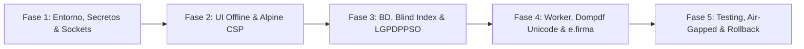

# Plan Integral de Primer Despliegue — ERP Dirección de Registro Civil (DRC)

**Guía Maestra para el Despliegue en Producción y Modernización de Arquitectura**  
**Versión:** 1.2 (Con Blind Index, Resiliencia Worker, Anti-Deadlocks, Auditoría LGPDPPSO, Fuentes Unicode DejaVu Sans y Respaldos Air-Gapped)  
**Fecha:** Agosto 2026  

---

## Estructura de Fases del Despliegue

Este directorio contiene las especificaciones técnicas y operativas paso a paso para llevar a cabo el primer despliegue oficial del ERP DRC en entorno de producción, garantizando alta disponibilidad, seguridad perimetral, integridad transaccional y rendimiento óptimo.

```
docs/Implementacion_primer_deploy/
├── README.md                                          # Índice general y hoja de ruta (este archivo)
├── fase_1_entorno_seguridad_secretos.md              # Fase 1: Infraestructura, PHP 8.2, Secretos, CSP y Sockets Redis
├── fase_2_ui_assets_locales_reactividad.md            # Fase 2: Assets Offline, TomSelect y Alpine.js CSP-Friendly
├── fase_3_bd_migraciones_criptografia.md              # Fase 3: MySQL 8, Migrate.php, Blind Index, Deadlocks y LGPDPPSO
├── fase_4_asincrono_reportes_pdf_cache.md             # Fase 4: Worker Resiliente, Dompdf (DejaVu Sans), e.firma y Redis
└── fase_5_testing_verificacion_golive_rollback.md     # Fase 5: Testing, 14 Smoke Tests, Respaldos Air-Gapped y Rollback
```

---

## Resumen Ejecutivo de las 5 Fases



### [Fase 1: Preparación del Entorno, Seguridad Perimetral y Gestión de Secretos](fase_1_entorno_seguridad_secretos.md)
* Configuración de `.env` en producción (`ENCRYPTION_KEY`, `BLIND_INDEX_KEY`, `CRON_SECRET`).
* Endurecimiento del servidor web (Apache 2.4 / Nginx / FrankenPHP) y reglas `.htaccess`.
* Cabeceras de seguridad CSP compatibles con assets locales.
* Configuración de permisos para el socket UNIX de Redis (`www-data` en grupo `redis`).
* Aceleración con **Zend OPcache** y directivas de sesión segura.

### [Fase 2: UI, Assets Locales (Desacople de CDN), TomSelect y Reactividad CSP-Friendly](fase_2_ui_assets_locales_reactividad.md)
* Empaquetado y descarga local de librerías en `assets/vendor/` para operación 100% offline / intranet gubernamental.
* Migración completa de `Select2` hacia **`TomSelect` (Vanilla JS)** para eliminar dependencias de jQuery y fallos en modales.
* Introducción de **`Alpine.js CSP-Friendly (@alpinejs/csp)`** con arquitectura `Alpine.data()` para cumplir con CSP sin `unsafe-eval`.
* Persistencia de temas visuales institucionales (Guinda) y Modo Oscuro.

### [Fase 3: Base de Datos, Migraciones Versionadas, Blind Index, Deadlocks y Auditoría LGPDPPSO](fase_3_bd_migraciones_criptografia.md)
* Despliegue de MySQL 8 / InnoDB con codificación `utf8mb4_unicode_ci` y usuarios de privilegios mínimos.
* Implementación del ejecutor de migraciones secuenciales (`php core/Migrate.php up`).
* **Blind Index para CURP:** Mitigación de inferencia criptográfica mediante cifrado con **IV 100% aleatorio** (`curp_encrypted`) y hash ciego HMAC-SHA256 indexado (`curp_bindex`).
* **Prevención de Deadlocks (Error 1213):** Orden jerárquico de adquisición de bloqueos y wrapper `Database::transactionWithRetry()`.
* **Auditoría de Lecturas (LGPDPPSO / INAI):** Trazabilidad obligatoria de consultas de CURP y expedientes para evitar el tráfico no autorizado de datos.

### [Fase 4: Procesamiento Asíncrono, Reportes, Dompdf Unicode, e.firma y Caché Redis](fase_4_asincrono_reportes_pdf_cache.md)
* Worker CLI (`core/Worker.php`) con **reconexión activa de PDO (`getActivePdo`)** para evitar errores `2006 MySQL server has gone away` tras inactividad.
* Control de permisos con **`umask 0027`** y `chmod 0664` para garantizar la descarga de reportes por el servidor web.
* **Dompdf con Fuentes Unicode (`DejaVu Sans`):** Renderizado sin corrupción de nombres en lenguas indígenas con saltillos y diéresis.
* **Arquitectura de Firma Electrónica Avanzada (FIEL / PKI X.509):** Sellado digital de actas con certificados `.cer` y llave privada `.key`.
* Rotación de logs diaria con **`logrotate`** y cron de purga del sistema operativo (`/etc/cron.daily/drc-cleanup`).

### [Fase 5: Testing Automatizado, 14 Smoke Tests, Respaldos Air-Gapped y Plan de Rollback](fase_5_testing_verificacion_golive_rollback.md)
* Pruebas unitarias (**PHPUnit 11**) con tests para Blind Index, Deadlocks y Concurrencia de Folios.
* Pruebas de interfaz de usuario con **Playwright E2E**.
* **14 Smoke Tests de Verificación Pre-Deploy** (incluyendo auditoría de lecturas y grafías indígenas).
* **Estrategia de Respaldos Desconectados (Air-Gapped / Cold Storage):** Respaldo diario cifrado con AES-256 (`backup_airgapped.sh`) contra ataques de *ransomware*.
* Runbook minuto a minuto de Go-Live (`T-60` a `T+60 min`) y scripts de Rollback automatizado en < 3 minutos.
