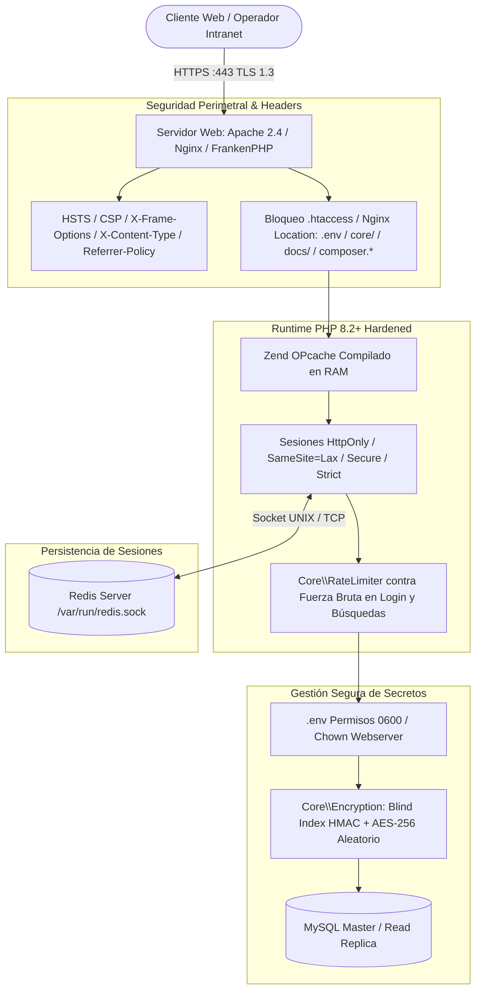

# Fase 1: Preparación del Entorno, Seguridad Perimetral y Gestión de Secretos

**Documento:** Plan de Implementación de Primer Despliegue — ERP DRC  
**Fase:** 1 de 5  
**Objetivo:** Establecer la infraestructura base, configurar el servidor web (Apache / Nginx / FrankenPHP) y PHP 8.2+, asegurar el aislamiento de secretos criptográficos, aplicar endurecimiento de permisos, blindar el acceso perimetral y configurar sockets seguros.

---

## 1. Objetivos y Alcance de la Fase

1. **Configuración del Runtime PHP 8.2+:** Instalar y verificar extensiones requeridas, activar **Zend OPcache** y parametrizar directivas seguras en `php.ini`.
2. **Gestión de Secretos y `.env`:** Generar claves criptográficas de alta entropía (`ENCRYPTION_KEY`, `BLIND_INDEX_KEY`, `CRON_SECRET`), aislar credenciales de base de datos y prohibir el rastreo en Git.
3. **Endurecimiento del Servidor Web:** Implementar configuraciones para **Apache 2.4**, **Nginx + PHP-FPM** y **FrankenPHP**, incluyendo cabeceras HTTP de seguridad (HSTS, CSP compatible, X-Frame-Options) y bloqueo en `.htaccess`.
4. **Matriz de Permisos del Sistema de Archivos y Sockets:** Aplicar permisos estrictos (Linux `chmod/chown` y Windows NTFS `icacls`) y configurar permisos del socket UNIX de Redis (`www-data` en grupo `redis`).
5. **Aislamiento y Hardening de Sesiones:** Configuración de cookies seguras (`HttpOnly`, `SameSite=Lax`, `Secure`, `use_strict_mode`).

---

## 2. Diagrama de Arquitectura de Seguridad Perimetral



---

## 3. Matriz de Variables de Entorno (`.env`) en Producción

El archivo `.env` **debe crearse exclusivamente en el servidor de producción** con permisos restringidos.

### 3.1. Plantilla Completa de Producción (`.env`)
```ini
# ==============================================================================
# CONFIGURACIÓN DE ENTORNO DE PRODUCCIÓN — ERP DRC
# ==============================================================================
APP_NAME="ERP Dirección de Registro Civil"
APP_ENV=production
APP_DEBUG=false
APP_URL=https://drc.municipio.gob.mx
APP_TIMEZONE="America/Mexico_City"

# Criptografía Simétrica (Clave principal para cifrado de datos con IV aleatorio)
# Generar con: php -r "echo bin2hex(random_bytes(32));"
ENCRYPTION_KEY=d7f3e1b0c94a5582f4e82b79103c84f29104a9d7c8163f4582910471b63e2849

# Blind Index Key (Clave independiente para generar hashes HMAC de búsqueda de CURP)
# Generar con: php -r "echo bin2hex(random_bytes(32));"
BLIND_INDEX_KEY=e8c2a1f09d3b4582e7f81a60124b95f382105a8d6c714e3691820562a54d1938

# Token de seguridad para ejecución de Workers y Crons por CLI
CRON_SECRET=a84f3920c8172648591028374659102837465910283746591028374659102837

# Base de Datos Principal (Master / Transaccional / Escritura)
DB_HOST=127.0.0.1
DB_PORT=3306
DB_NAME=drc_erp
DB_USER=drc_app
DB_PASS=PasswordUltraSeguroProduccion2026!#

# Base de Datos Réplica (Opcional - Lectura para DataTables y Reportes)
DB_READ_HOST=127.0.0.1
DB_READ_PORT=3306
DB_READ_NAME=drc_erp
DB_READ_USER=drc_app_read
DB_READ_PASS=PasswordReadReplica2026!#

# Caché y Sesiones (redis / memcached / file)
CACHE_DRIVER=redis
REDIS_HOST=127.0.0.1
REDIS_PORT=6379
REDIS_SOCKET=/var/run/redis/redis-server.sock
REDIS_TIMEOUT=1.0
REDIS_PASSWORD=

# Ruta del binario de PHP para workers en segundo plano
# En Windows: C:\xampp\php\php.exe | En Linux: /usr/bin/php
PHP_BIN=/usr/bin/php

# Retención de Auditoría y Logs
AUDIT_LOG_RETENTION_DAYS=365
ERROR_LOG_RETENTION_DAYS=90
```

### 3.2. Script CLI para Generación Segura de Llaves
```bash
# Generar clave de cifrado AES-256 (32 bytes = 64 hex chars)
php -r "echo 'ENCRYPTION_KEY=' . bin2hex(random_bytes(32)) . PHP_EOL;"

# Generar clave para Blind Index HMAC (32 bytes = 64 hex chars)
php -r "echo 'BLIND_INDEX_KEY=' . bin2hex(random_bytes(32)) . PHP_EOL;"

# Generar token secreto de Cron/Worker (32 bytes = 64 hex chars)
php -r "echo 'CRON_SECRET=' . bin2hex(random_bytes(32)) . PHP_EOL;"
```

---

## 4. Endurecimiento del Servidor Web y Cabeceras CSP

### 4.1. Configuración de Apache 2.4 (VirtualHost HTTPS)
```apache
<VirtualHost *:443>
    ServerName drc.municipio.gob.mx
    ServerAdmin admin@drc.municipio.gob.mx
    DocumentRoot "C:/xampp/htdocs/DRC"

    SSLEngine on
    SSLCertificateFile "C:/xampp/apache/crt/drc.crt"
    SSLCertificateKeyFile "C:/xampp/apache/crt/drc.key"
    SSLProtocol -all +TLSv1.2 +TLSv1.3
    SSLCipherSuite HIGH:!aNULL:!MD5:!3DES:!CAMELLIA

    <Directory "C:/xampp/htdocs/DRC">
        Options -Indexes -FollowSymLinks +SymLinksIfOwnerMatch
        AllowOverride All
        Require all granted
    </Directory>

    # Cabeceras de Seguridad Perimetral
    Header always set X-Frame-Options "DENY"
    Header always set X-Content-Type-Options "nosniff"
    Header always set X-XSS-Protection "1; mode=block"
    Header always set Referrer-Policy "strict-origin-when-cross-origin"
    Header always set Permissions-Policy "geolocation=(), microphone=(), camera=(), payment=()"
    Header always set Strict-Transport-Security "max-age=31536000; includeSubDomains; preload"
    
    # CSP Estricta compatible con assets locales y Alpine CSP-friendly
    Header always set Content-Security-Policy "default-src 'self'; script-src 'self' 'unsafe-inline'; style-src 'self' 'unsafe-inline'; font-src 'self'; img-src 'self' data: https://ui-avatars.com; connect-src 'self';"

    ErrorLog "logs/drc_error.log"
    CustomLog "logs/drc_access.log" combined
</VirtualHost>
```

### 4.2. Configuración de Nginx + PHP-FPM
```nginx
server {
    listen 443 ssl http2;
    server_name drc.municipio.gob.mx;
    root /var/www/DRC;
    index public/index.php index.php;

    ssl_certificate /etc/ssl/certs/drc.crt;
    ssl_certificate_key /etc/ssl/private/drc.key;
    ssl_protocols TLSv1.2 TLSv1.3;
    ssl_ciphers HIGH:!aNULL:!MD5;

    # Cabeceras de Seguridad
    add_header X-Frame-Options "DENY" always;
    add_header X-Content-Type-Options "nosniff" always;
    add_header Referrer-Policy "strict-origin-when-cross-origin" always;
    add_header Strict-Transport-Security "max-age=31536000; includeSubDomains" always;
    add_header Content-Security-Policy "default-src 'self'; script-src 'self' 'unsafe-inline'; style-src 'self' 'unsafe-inline'; font-src 'self'; img-src 'self' data: https://ui-avatars.com; connect-src 'self';" always;

    # Bloqueo estricto de archivos y directorios sensibles
    location ~ /\.(env|git|htaccess) {
        deny all;
        return 404;
    }

    location ^~ /core/ {
        deny all;
        return 403;
    }

    location ^~ /docs/ {
        deny all;
        return 403;
    }

    location ^~ /logs/ {
        deny all;
        return 403;
    }

    location ^~ /cache/ {
        deny all;
        return 403;
    }

    # Redirección de exports protegidos
    location ^~ /public/exports/ {
        internal;
    }

    location / {
        try_files $uri $uri/ /public/index.php?$query_string;
    }

    location ~ \.php$ {
        include snippets/fastcgi-php.conf;
        fastcgi_pass unix:/var/run/php/php8.2-fpm.sock;
        fastcgi_param SCRIPT_FILENAME $document_root$fastcgi_script_name;
        fastcgi_hide_header X-Powered-By;
    }
}
```

---

## 5. Configuración y Permisos del Socket UNIX de Redis

En servidores Linux, utilizar un socket UNIX en lugar de TCP (`127.0.0.1:6379`) reduce la latencia de sesiones y lecturas de caché en un 25-30%. Sin embargo, es mandatorio configurar los permisos del grupo:

### 5.1. Configuración de Redis en Linux (`/etc/redis/redis.conf`)
```ini
# Habilitar socket UNIX
unixsocket /var/run/redis/redis-server.sock
unixsocketperm 770

# Deshabilitar puerto TCP si solo se usa localmente o mantenerlo para contingencia
port 6379
```

### 5.2. Asignación de Permisos al Usuario Web
```bash
# Agregar el usuario web (www-data / nginx) al grupo de redis
sudo usermod -aG redis www-data

# Reiniciar Redis y PHP-FPM
sudo systemctl restart redis-server
sudo systemctl restart php8.2-fpm
```

### 5.3. Configuración en `php.ini` para Sesiones por Socket
```ini
; En Linux (Socket UNIX):
session.save_handler = redis
session.save_path = "unix:///var/run/redis/redis-server.sock?prefix=DRC_SESS_&timeout=1.0"

; En Windows / XAMPP (TCP):
; session.save_path = "tcp://127.0.0.1:6379?prefix=DRC_SESS_&timeout=1.0"
```

---

## 6. Matriz de Permisos y Scripts de Hardening

### 6.1. Script de Permisos para Linux (`scripts/hardening_permissions_linux.sh`)
```bash
#!/bin/bash
PROJECT_DIR="/var/www/DRC"
WEB_USER="www-data"
WEB_GROUP="www-data"

echo "Aplicando permisos estrictos a $PROJECT_DIR..."

chown -R $WEB_USER:$WEB_GROUP $PROJECT_DIR

find $PROJECT_DIR -type d -exec chmod 0755 {} \;
find $PROJECT_DIR -type f -exec chmod 0644 {} \;

# .env solo legible por el usuario web
chmod 0600 $PROJECT_DIR/.env

# Carpetas de escritura temporal
chmod -R 0770 $PROJECT_DIR/cache
chmod -R 0770 $PROJECT_DIR/logs
chmod -R 0770 $PROJECT_DIR/public/exports

# Socket Redis
usermod -aG redis $WEB_USER

echo "Permisos aplicados correctamente."
```

---

## 7. Checklist de Aceptación de la Fase 1

- [ ] Archivo `.env` generado con `ENCRYPTION_KEY`, `BLIND_INDEX_KEY` y `CRON_SECRET` nuevos e independientes.
- [ ] Intentar acceder a `https://servidor/.env` → Debe responder **403 o 404**.
- [ ] Intentar acceder a `https://servidor/core/Database.php` → Debe responder **403 Forbidden**.
- [ ] Si se usa socket UNIX de Redis, verificar que `www-data` pertenezca al grupo `redis` y las sesiones inicien sin error.
- [ ] Validar con `curl -I https://servidor/` que las cabeceras `X-Frame-Options`, `X-Content-Type-Options`, `Content-Security-Policy` y `Strict-Transport-Security` estén presentes.
- [ ] Verificar que `opcache.enable=1` esté activo en producción.
- [ ] Ejecutar `composer dump-autoload -o` para congelar el mapa de clases PSR-4.
