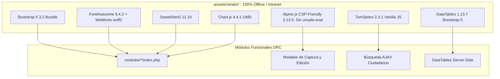

# Fase 2: UI, Assets Locales (Desacople de CDN), TomSelect y Reactividad CSP-Friendly

**Documento:** Plan de Implementación de Primer Despliegue — ERP DRC  
**Fase:** 2 de 5  
**Objetivo:** Desacoplar el frontend de CDNs externas garantizando operación 100% offline en redes gubernamentales aisladas, estandarizar la selección dinámica con TomSelect (Vanilla JS) y asegurar reactividad declarativa con **Alpine.js CSP-Friendly (`@alpinejs/csp`)** para cumplir con políticas estrictas de seguridad de contenido sin `unsafe-eval`.

---

## 1. Objetivos y Alcance de la Fase

1. **Empaquetado Local de Dependencias UI:** Descargar y alojar en `assets/vendor/` Bootstrap 5.3.2, FontAwesome 6.4.2, DataTables 1.13.7, SweetAlert2 11.10.0, Chart.js 4.4.1 y **Alpine.js CSP-Friendly 3.13.5**.
2. **Migración Completa de Select2 a TomSelect:** Eliminar la dependencia de jQuery en selectores dinámicos, resolviendo bloqueos de foco dentro de modales de Bootstrap 5.
3. **Integración de Alpine.js con Arquitectura `Alpine.data()`:** Registrar componentes de interfaz de manera estructurada para evitar la evaluación insegura de código en el DOM (`unsafe-eval`), manteniendo compatibilidad total con la CSP institucional.
4. **Consistencia Visual Institucional y Modo Oscuro:** Preservar la paleta Guinda institucional (`--primary-color: #800020; --secondary-color: #5b0017;`) y la alternancia de modo oscuro en `localStorage`.

---

## 2. Diagrama de Dependencias y Carga Frontend



---

## 3. Inventario y Descarga de Paquetes Locales

### 3.1. Estructura de Directorios en `assets/vendor/`
```
c:\xampp\htdocs\DRC\assets\vendor\
├── bootstrap/
│   ├── css/bootstrap.min.css
│   └── js/bootstrap.bundle.min.js
├── fontawesome/
│   ├── css/all.min.css
│   └── webfonts/
│       ├── fa-solid-900.woff2
│       ├── fa-regular-400.woff2
│       └── fa-brands-400.woff2
├── datatables/
│   ├── css/dataTables.bootstrap5.min.css
│   └── js/
│       ├── jquery.dataTables.min.js
│       └── dataTables.bootstrap5.min.js
├── tom-select/
│   ├── css/tom-select.bootstrap5.min.css
│   └── js/tom-select.complete.min.js
├── sweetalert2/
│   ├── sweetalert2.min.css
│   └── sweetalert2.all.min.js
├── chartjs/
│   └── chart.umd.min.js
└── alpine/
    └── alpine-csp.min.js             # Compilación CSP-friendly sin new Function()
```

### 3.2. Script de Descarga de Assets con Alpine CSP-Friendly

```powershell
# scripts/download_assets.ps1
$vendorDir = "C:\xampp\htdocs\DRC\assets\vendor"

# Crear directorios
New-Item -ItemType Directory -Force -Path "$vendorDir\bootstrap\css", "$vendorDir\bootstrap\js"
New-Item -ItemType Directory -Force -Path "$vendorDir\fontawesome\css", "$vendorDir\fontawesome\webfonts"
New-Item -ItemType Directory -Force -Path "$vendorDir\datatables\css", "$vendorDir\datatables\js"
New-Item -ItemType Directory -Force -Path "$vendorDir\tom-select\css", "$vendorDir\tom-select\js"
New-Item -ItemType Directory -Force -Path "$vendorDir\sweetalert2"
New-Item -ItemType Directory -Force -Path "$vendorDir\chartjs"
New-Item -ItemType Directory -Force -Path "$vendorDir\alpine"

# Descargas Bootstrap 5.3.2
Invoke-WebRequest -Uri "https://cdn.jsdelivr.net/npm/bootstrap@5.3.2/dist/css/bootstrap.min.css" -OutFile "$vendorDir\bootstrap\css\bootstrap.min.css"
Invoke-WebRequest -Uri "https://cdn.jsdelivr.net/npm/bootstrap@5.3.2/dist/js/bootstrap.bundle.min.js" -OutFile "$vendorDir\bootstrap\js\bootstrap.bundle.min.js"

# Descargas TomSelect 2.3.1
Invoke-WebRequest -Uri "https://cdn.jsdelivr.net/npm/tom-select@2.3.1/dist/css/tom-select.bootstrap5.min.css" -OutFile "$vendorDir\tom-select\css\tom-select.bootstrap5.min.css"
Invoke-WebRequest -Uri "https://cdn.jsdelivr.net/npm/tom-select@2.3.1/dist/js/tom-select.complete.min.js" -OutFile "$vendorDir\tom-select\js\tom-select.complete.min.js"

# Descargas SweetAlert2 11.10
Invoke-WebRequest -Uri "https://cdn.jsdelivr.net/npm/sweetalert2@11.10.0/dist/sweetalert2.min.css" -OutFile "$vendorDir\sweetalert2\sweetalert2.min.css"
Invoke-WebRequest -Uri "https://cdn.jsdelivr.net/npm/sweetalert2@11.10.0/dist/sweetalert2.all.min.js" -OutFile "$vendorDir\sweetalert2\sweetalert2.all.min.js"

# Descargas Chart.js 4.4.1
Invoke-WebRequest -Uri "https://cdn.jsdelivr.net/npm/chart.js@4.4.1/dist/chart.umd.min.js" -OutFile "$vendorDir\chartjs\chart.umd.min.js"

# Descargas Alpine.js CSP-Friendly (@alpinejs/csp)
# La versión CSP elimina 'unsafe-eval' y requiere declarar componentes con Alpine.data()
Invoke-WebRequest -Uri "https://cdn.jsdelivr.net/npm/@alpinejs/csp@3.13.5/dist/cdn.min.js" -OutFile "$vendorDir\alpine\alpine-csp.min.js"

Write-Host "Todos los assets y Alpine CSP-friendly fueron descargados con éxito."
```

---

## 4. Estandarización de TomSelect (Vanilla JS)

`TomSelect` reemplaza a `Select2` en todas las pantallas. Se encapsula en `assets/js/global.js`:

```javascript
/**
 * Inicializa un selector TomSelect para búsqueda remota de ciudadanos.
 */
function initCiudadanoSelect(elementId, customConfig = {}) {
    const el = (typeof elementId === 'string') ? document.getElementById(elementId) : elementId;
    if (!el) return null;

    return new TomSelect(el, Object.assign({
        valueField: 'id',
        labelField: 'nombre_completo',
        searchField: ['nombre_completo', 'curp'],
        maxItems: 1,
        placeholder: 'Escriba nombre o CURP...',
        loadThrottle: 300,
        create: false,
        plugins: ['clear_button'],
        load: function(query, callback) {
            if (query.length < 3) return callback();
            
            const searchUrl = `../../modules/ciudadanos/search.php?q=${encodeURIComponent(query)}`;
            fetch(searchUrl)
                .then(res => res.json())
                .then(json => {
                    callback(json.data || []);
                })
                .catch(() => callback());
        },
        render: {
            option: function(item, escape) {
                return `<div class="py-2 px-3 border-bottom">
                    <div class="fw-bold text-dark">${escape(item.nombre_completo)}</div>
                    <small class="text-muted"><i class="fa-solid fa-id-card me-1 text-primary"></i>CURP: ${escape(item.curp || 'S/C')}</small>
                </div>`;
            },
            item: function(item, escape) {
                return `<div><strong>${escape(item.nombre_completo)}</strong> <span class="text-muted">(${escape(item.curp || 'S/C')})</span></div>`;
            },
            no_results: function(data, escape) {
                return `<div class="p-2 text-muted small">No se encontraron ciudadanos con: "${escape(data.input)}"</div>`;
            }
        }
    }, customConfig));
}
```

---

## 5. Implementación de Reactividad Segura con `Alpine.data()` (CSP-Compliant)

Para cumplir con la directiva CSP sin requerir `'unsafe-eval'`, los componentes reactivos se declaran en JavaScript usando `Alpine.data()` en lugar de expresiones embebidas en cadenas dentro del HTML:

### 5.1. Declaración de Componentes en `assets/js/components-alpine.js`
```javascript
document.addEventListener('alpine:init', () => {
    // 1. Componente de Formulario de Matrimonios
    Alpine.data('formMatrimonios', () => ({
        regimen: 'SOCIEDAD_CONYUGAL',
        testigos: 2,
        folioCapitulaciones: '',
        get requiereCapitulaciones() {
            return this.regimen === 'SEPARACION_BIENES';
        }
    }));

    // 2. Componente de Inexistencias y Cálculo Dinámico
    Alpine.data('formInexistencias', () => ({
        tipoConstancia: 'NACIMIENTO',
        modalidad: 'ESTANDAR',
        costoBase: 180,
        get costoTotal() {
            return this.modalidad === 'URGENTE' ? (this.costoBase * 1.5) : this.costoBase;
        },
        get diasEstimados() {
            return this.modalidad === 'URGENTE' ? 2 : 5;
        }
    }));
});
```

### 5.2. Uso en HTML (Limpio y Compatible con CSP)
```html
<!-- modules/matrimonios/modal_registro.php -->
<div x-data="formMatrimonios">
    <div class="row g-3">
        <div class="col-md-6">
            <label class="form-label fw-bold">Régimen Patrimonial</label>
            <select class="form-select" x-model="regimen" name="regimen_patrimonial" required>
                <option value="SOCIEDAD_CONYUGAL">Sociedad Conyugal</option>
                <option value="SEPARACION_BIENES">Separación de Bienes</option>
                <option value="MIXTO">Régimen Mixto</option>
            </select>
        </div>

        <div class="col-md-6">
            <label class="form-label fw-bold">Número de Testigos</label>
            <select class="form-select" x-model.number="testigos" name="numero_testigos">
                <option value="2">2 Testigos (Mínimo Legal)</option>
                <option value="3">3 Testigos</option>
                <option value="4">4 Testigos</option>
            </select>
        </div>

        <!-- Alerta y campo condicional reactivo -->
        <div class="col-12" x-show="requiereCapitulaciones" x-transition>
            <div class="alert alert-warning py-2 border-warning">
                <i class="fa-solid fa-file-shield me-2"></i>
                <strong>Requisito Legal:</strong> En separación de bienes, capture el número de escritura o folio notarial de capitulaciones.
                <input type="text" class="form-control mt-2" x-model="folioCapitulaciones" name="folio_capitulaciones" placeholder="No. de Escritura Notarial / Folio">
            </div>
        </div>
    </div>
</div>
```

---

## 6. Sustitución de Referencias en Plantillas Maestras

### 6.1. Encabezado Global (`head`)
```html
<head>
    <meta charset="UTF-8">
    <meta name="viewport" content="width=device-width, initial-scale=1.0">
    <title>ERP DRC — Dirección de Registro Civil</title>
    
    <!-- Assets Locales (No CDN) -->
    <link rel="stylesheet" href="../assets/vendor/bootstrap/css/bootstrap.min.css">
    <link rel="stylesheet" href="../assets/vendor/fontawesome/css/all.min.css">
    <link rel="stylesheet" href="../assets/vendor/datatables/css/dataTables.bootstrap5.min.css">
    <link rel="stylesheet" href="../assets/vendor/tom-select/css/tom-select.bootstrap5.min.css">
    <link rel="stylesheet" href="../assets/vendor/sweetalert2/sweetalert2.min.css">
    <link rel="stylesheet" href="../assets/css/style.css">
    
    <script>if(localStorage.getItem('theme')==='dark'){document.documentElement.classList.add('dark-mode');}</script>
</head>
```

### 6.2. Cierre de Body (`scripts`)
```html
    <!-- Scripts Locales (No CDN) -->
    <script src="../assets/vendor/bootstrap/js/bootstrap.bundle.min.js"></script>
    <script src="https://code.jquery.com/jquery-3.7.1.min.js"></script>
    <script src="../assets/vendor/datatables/js/jquery.dataTables.min.js"></script>
    <script src="../assets/vendor/datatables/js/dataTables.bootstrap5.min.js"></script>
    <script src="../assets/vendor/tom-select/js/tom-select.complete.min.js"></script>
    <script src="../assets/vendor/sweetalert2/sweetalert2.all.min.js"></script>
    <script src="../assets/vendor/chartjs/chart.umd.min.js"></script>
    
    <!-- Alpine.js CSP-Friendly y Registro de Componentes -->
    <script src="../assets/js/components-alpine.js"></script>
    <script src="../assets/vendor/alpine/alpine-csp.min.js" defer></script>
    <script src="../assets/js/global.js"></script>
</body>
</html>
```

---

## 7. Checklist de Aceptación de la Fase 2

- [ ] Todos los archivos en `assets/vendor/` existen y están completos.
- [ ] Cargar la aplicación con cabecera `Content-Security-Policy` estricta (sin `'unsafe-eval'`) y verificar que la consola del navegador reporte **cero violaciones de CSP**.
- [ ] Probar que `TomSelect` busque ciudadanos sin trabas al escribir 3 caracteres en modales anidados.
- [ ] Probar la reactividad de `Alpine.data()` en matrimonios y constancias de inexistencia.
- [ ] Alternar el Modo Oscuro y confirmar persistencia sin parpadeos visuales.
