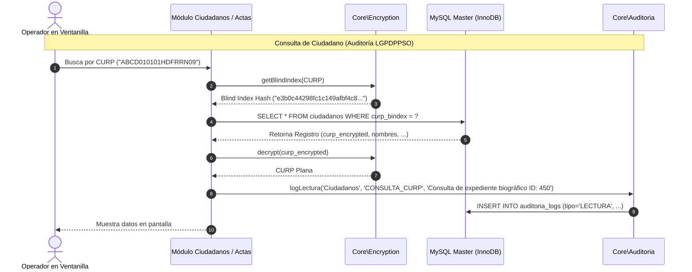

# Fase 3: Base de Datos, Migraciones Versionadas, Blind Index, Prevención de Deadlocks y Auditoría LGPDPPSO

**Documento:** Plan de Implementación de Primer Despliegue — ERP DRC  
**Fase:** 3 de 5  
**Objetivo:** Desplegar el motor MySQL 8.0+ / MariaDB con codificación `utf8mb4_unicode_ci`, implementar el orquestador de migraciones (`core/Migrate.php`), blindar la privacidad de la CURP mediante **Blind Index con IV aleatorio**, prevenir **Deadlocks (interbloqueos)** en alta concurrencia, soportar **grafías indígenas** y establecer la **auditoría de lecturas** conforme a la normativa de protección de datos personales (LGPDPPSO / INAI).

---

## 1. Objetivos y Alcance de la Fase

1. **Despliegue del Esquema Relacional Formal:** Inicializar `drc_erp` con soporte de nombres en lenguas originarias (`utf8mb4_unicode_ci`), integridad referencial estricta y almacenamiento de precisión (`VARCHAR` para folios y líneas de pago).
2. **Motor de Migraciones Versionadas (`core/Migrate.php`):** Reemplazar scripts manuales sueltos por un ejecutor CLI transaccional e idempotente con tabla de control `schema_migrations`.
3. **Criptografía con Blind Index (HMAC + IV Aleatorio):** Eliminar la vulnerabilidad de inferencia por frecuencia. La CURP se cifra con un **IV 100% aleatorio**, mientras que las búsquedas exactas se realizan mediante un **Blind Index** derivado con HMAC-SHA256 (`BLIND_INDEX_KEY`).
4. **Prevención de Deadlocks (Error 1213) y Reintentos Automáticos:** Estandarizar el orden jerárquico de adquisición de bloqueos en transacciones y encapsular reintentos con backoff exponencial.
5. **Auditoría de Lecturas y Consultas de Datos Personales (LGPDPPSO / INAI):** Registrar en bitácora no solo las escrituras, sino las búsquedas de CURP y consultas de actas realizadas por los operadores para prevenir el tráfico no autorizado de datos biográficos.
6. **Transaccionalidad en Reglas de Negocio:** Actualización atómica de estado vital (`FINADO` al registrar defunción) y Soft Delete seguro.

---

## 2. Diagrama de la Arquitectura Criptográfica y Auditoría de Lecturas



---

## 3. Implementación de Criptografía Segura (`Core\Encryption`)

Se implementa el esquema de **Blind Index + IV Aleatorio**, evitando que ciphertexts idénticos revelen datos personales:

```php
<?php
// core/Encryption.php
namespace Core;

class Encryption {
    private static ?string $encKey = null;
    private static ?string $blindKey = null;

    private static function initKeys(): void {
        if (self::$encKey === null) {
            $envPath = dirname(__DIR__) . '/.env';
            $env = file_exists($envPath) ? @parse_ini_file($envPath) : [];
            
            $key = $env['ENCRYPTION_KEY'] ?? getenv('ENCRYPTION_KEY');
            $bKey = $env['BLIND_INDEX_KEY'] ?? getenv('BLIND_INDEX_KEY');

            if (empty($key) || empty($bKey)) {
                throw new \RuntimeException("Faltan ENCRYPTION_KEY o BLIND_INDEX_KEY en el archivo .env.");
            }

            self::$encKey = hash('sha256', $key, true);
            self::$blindKey = hash('sha256', $bKey, true);
        }
    }

    public static function getBlindIndex(string $plaintext): ?string {
        if ($plaintext === '') return null;
        self::initKeys();
        $clean = mb_strtoupper(trim($plaintext), 'UTF-8');
        return hash_hmac('sha256', $clean, self::$blindKey);
    }

    public static function encrypt(?string $data): ?string {
        if ($data === null || $data === '') return null;
        self::initKeys();

        $iv = random_bytes(16); // IV aleatorio seguro
        $encrypted = openssl_encrypt($data, 'aes-256-cbc', self::$encKey, OPENSSL_RAW_DATA, $iv);

        return 'v2:' . base64_encode($iv . $encrypted);
    }

    public static function decrypt(?string $payload): ?string {
        if ($payload === null || $payload === '') return null;
        self::initKeys();

        if (str_starts_with($payload, 'v2:')) {
            $raw = base64_decode(substr($payload, 3), true);
            if ($raw === false || strlen($raw) < 32) return $payload;
            
            $iv = substr($raw, 0, 16);
            $ciphertext = substr($raw, 16);
            $decrypted = openssl_decrypt($ciphertext, 'aes-256-cbc', self::$encKey, OPENSSL_RAW_DATA, $iv);
            return $decrypted !== false ? $decrypted : $payload;
        }

        $raw = base64_decode($payload, true);
        if ($raw !== false && strlen($raw) >= 32) {
            $iv = substr($raw, 0, 16);
            $ciphertext = substr($raw, 16);
            $decrypted = openssl_decrypt($ciphertext, 'aes-256-cbc', self::$encKey, OPENSSL_RAW_DATA, $iv);
            if ($decrypted !== false) return $decrypted;
        }

        return $payload;
    }

    public static function sign(string $data): string {
        self::initKeys();
        return hash_hmac('sha256', $data, self::$encKey);
    }

    public static function verifySignature(string $data, string $signature): bool {
        return hash_equals(self::sign($data), $signature);
    }
}
```

---

## 4. DDL de Migraciones (`docs/migrations/`)

### 4.1. `001_initial_schema.sql` (Con Blind Index y Soporte Unicode para Grafías Indígenas)
```sql
CREATE TABLE IF NOT EXISTS usuarios (
    id INT AUTO_INCREMENT PRIMARY KEY,
    nombre VARCHAR(150) NOT NULL,
    correo VARCHAR(150) NOT NULL UNIQUE,
    password_hash VARCHAR(255) NOT NULL,
    rol ENUM('ADMIN', 'COORDINADOR', 'SUPERVISOR', 'OPERADOR') NOT NULL DEFAULT 'OPERADOR',
    estatus TINYINT(1) NOT NULL DEFAULT 1,
    permiso_registro_nacimientos TINYINT(1) NOT NULL DEFAULT 0,
    permiso_registro_matrimonios TINYINT(1) NOT NULL DEFAULT 0,
    permiso_registro_divorcios TINYINT(1) NOT NULL DEFAULT 0,
    permiso_registro_defunciones TINYINT(1) NOT NULL DEFAULT 0,
    permiso_registro_inscripciones TINYINT(1) NOT NULL DEFAULT 0,
    permiso_registro_reconocimientos TINYINT(1) NOT NULL DEFAULT 0,
    permiso_actas_locales TINYINT(1) NOT NULL DEFAULT 0,
    permiso_actas_foraneas TINYINT(1) NOT NULL DEFAULT 0,
    permiso_constancias TINYINT(1) NOT NULL DEFAULT 0,
    permiso_curp TINYINT(1) NOT NULL DEFAULT 0,
    permiso_tickets TINYINT(1) NOT NULL DEFAULT 0,
    permiso_exportar TINYINT(1) NOT NULL DEFAULT 0,
    permiso_peticiones_rapidas TINYINT(1) NOT NULL DEFAULT 1,
    permiso_turnos TINYINT(1) NOT NULL DEFAULT 1,
    creado_en TIMESTAMP DEFAULT CURRENT_TIMESTAMP
) ENGINE=InnoDB DEFAULT CHARSET=utf8mb4 COLLATE=utf8mb4_unicode_ci;

-- Tabla de ciudadanos con soporte de grafías indígenas (apóstrofes/saltillos, diéresis)
CREATE TABLE IF NOT EXISTS ciudadanos (
    id INT AUTO_INCREMENT PRIMARY KEY,
    curp_bindex VARCHAR(64) NOT NULL UNIQUE,      -- Blind Index HMAC para búsquedas B-Tree
    curp_encrypted VARCHAR(255) NOT NULL,         -- Ciphertext con IV 100% aleatorio
    nombre VARCHAR(100) NOT NULL,                 -- Soporta: Xóchitl, Ta'an, K'an, etc.
    apellido_paterno VARCHAR(100) NOT NULL,
    apellido_materno VARCHAR(100) DEFAULT NULL,
    fecha_nacimiento DATE NOT NULL,
    sexo ENUM('HOMBRE', 'MUJER', 'NO_BINARIO') NOT NULL,
    estado_vital ENUM('VIVO', 'FINADO') NOT NULL DEFAULT 'VIVO',
    estado TINYINT(1) NOT NULL DEFAULT 1,         -- 1=Activo, 0=Soft Delete
    deleted_at DATETIME DEFAULT NULL,
    deleted_by INT DEFAULT NULL,
    creado_en TIMESTAMP DEFAULT CURRENT_TIMESTAMP,
    INDEX idx_nombre_apellidos (nombre, apellido_paterno, apellido_materno),
    INDEX idx_estado_vital (estado_vital, estado)
) ENGINE=InnoDB DEFAULT CHARSET=utf8mb4 COLLATE=utf8mb4_unicode_ci;
```

### 4.2. `003_jobs_auditoria_lgpdp.sql` (Auditoría Integral de Lectura y Escritura)
```sql
CREATE TABLE IF NOT EXISTS auditoria_logs (
    id BIGINT AUTO_INCREMENT PRIMARY KEY,
    usuario_id INT DEFAULT NULL,
    tipo_evento ENUM('ESCRITURA', 'LECTURA', 'AUTENTICACION', 'EXPORTACION') NOT NULL DEFAULT 'ESCRITURA',
    modulo VARCHAR(100) NOT NULL,
    accion VARCHAR(50) NOT NULL,
    detalles TEXT DEFAULT NULL,
    ip_origen VARCHAR(45) NOT NULL,
    creado_en TIMESTAMP DEFAULT CURRENT_TIMESTAMP,
    INDEX idx_usuario_fecha (usuario_id, creado_en),
    INDEX idx_tipo_modulo (tipo_evento, modulo),
    FOREIGN KEY (usuario_id) REFERENCES usuarios(id) ON DELETE SET NULL
) ENGINE=InnoDB DEFAULT CHARSET=utf8mb4 COLLATE=utf8mb4_unicode_ci;
```

---

## 5. Prevención de Deadlocks y Helper de Reintentos

### 5.1. Regla de Orden Jerárquico de Bloqueos
$$\mathbf{1^\circ}\text{ folios\_secuencia (FOR UPDATE)} \longrightarrow \mathbf{2^\circ}\text{ ciudadanos (SELECT / UPDATE)} \longrightarrow \mathbf{3^\circ}\text{ tabla del acto (INSERT / UPDATE)}$$

### 5.2. Helper `Database::transactionWithRetry()`
```php
// core/Database.php
public static function transactionWithRetry(callable $callback, int $maxRetries = 3) {
    $pdo = self::getConnection();
    $attempts = 0;

    while ($attempts < $maxRetries) {
        $attempts++;
        try {
            $pdo->beginTransaction();
            $result = $callback($pdo);
            $pdo->commit();
            return $result;
        } catch (\PDOException $e) {
            if ($pdo->inTransaction()) {
                $pdo->rollBack();
            }

            $isDeadlock = ($e->getCode() == '40001' || str_contains($e->getMessage(), '1213') || str_contains($e->getMessage(), '1205'));

            if ($isDeadlock && $attempts < $maxRetries) {
                usleep(rand(20000, 50000) * $attempts); // Backoff con jitter
                continue;
            }

            throw $e;
        }
    }
}
```

---

## 6. Auditoría de Lecturas de Datos Personales (LGPDPPSO)

Para dar cumplimiento a la ley de datos personales y evitar el espionaje de expedientes, se registra en auditoría cada búsqueda por CURP o consulta de acta:

```php
// core/Auditoria.php
public static function logLectura(string $modulo, string $accion, string $detalles): void {
    try {
        $pdo = Database::getConnection();
        $userId = $_SESSION['user_id'] ?? null;
        $ip = $_SERVER['REMOTE_ADDR'] ?? 'CLI';

        $stmt = $pdo->prepare("INSERT INTO auditoria_logs (usuario_id, tipo_evento, modulo, accion, detalles, ip_origen) VALUES (?, 'LECTURA', ?, ?, ?, ?)");
        $stmt->execute([$userId, $modulo, $accion, $detalles, $ip]);
    } catch (\Exception $e) {
        // En auditoría de lectura, no interrumpir la experiencia de usuario si falla el log
        error_log("Fallo al registrar log de lectura: " . $e->getMessage());
    }
}
```

---

## 7. Checklist de Aceptación de la Fase 3

- [ ] Base de datos `drc_erp` creada con `utf8mb4_unicode_ci`.
- [ ] Registrar un ciudadano con nombres que incluyan caracteres originarios (ej. *Ta'an Xóchitl K'an*) y validar que no se corrompa en la base de datos ni al consultarlo.
- [ ] Validar que 3 cifrados de la misma CURP generen ciphertexts diferentes y Blind Indexes idénticos.
- [ ] Ejecutar una búsqueda por CURP en `modules/ciudadanos/search.php` y corroborar en la tabla `auditoria_logs` que se haya creado un registro de `tipo_evento = 'LECTURA'`.
- [ ] Simular un Deadlock en `Database::transactionWithRetry()` y comprobar que se resuelva automáticamente en el segundo intento.
- [ ] Registrar defunción y confirmar actualización atómica de `ciudadanos.estado_vital = 'FINADO'`.
