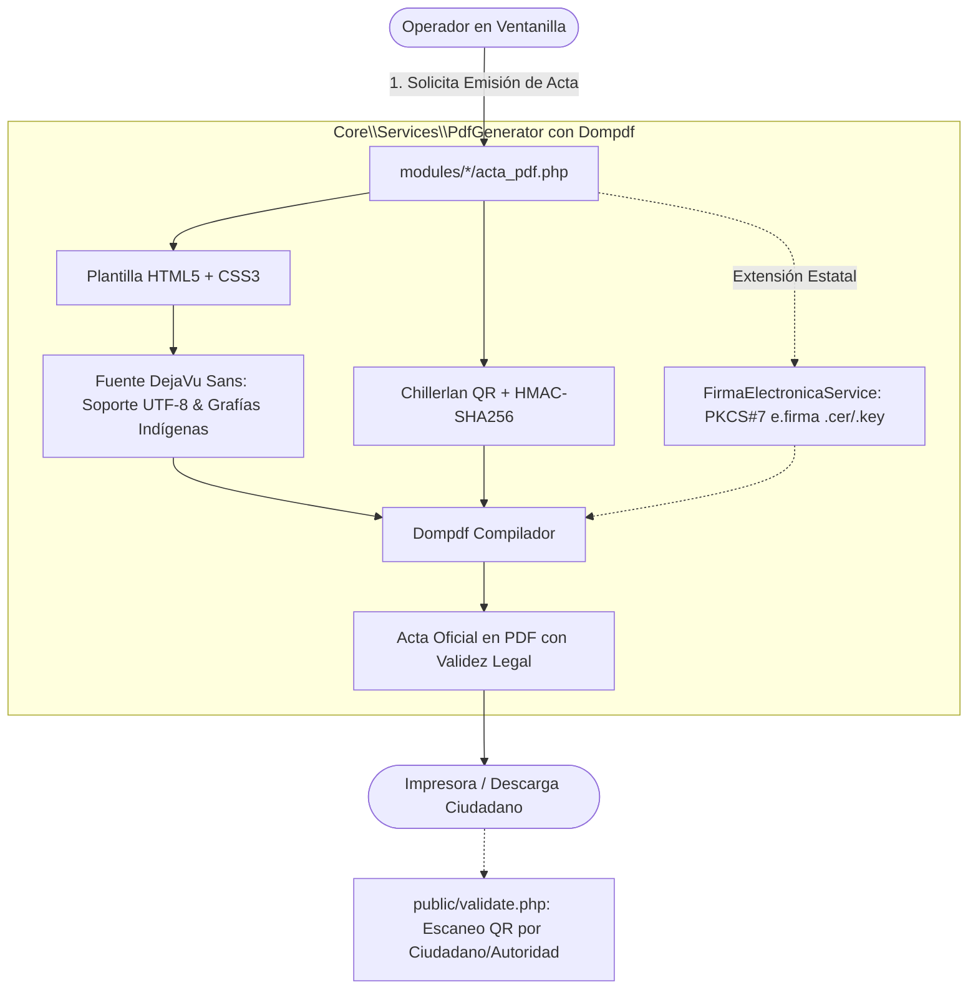

# Fase 4: Procesamiento Asíncrono, Reportes, PDF con Fuentes Unicode, e.firma y Caché Redis

**Documento:** Plan de Implementación de Primer Despliegue — ERP DRC  
**Fase:** 4 de 5  
**Objetivo:** Desplegar el servicio de tareas en segundo plano (Worker CLI) con **reconexión automática de PDO**, modernizar el motor de actas PDF con **Dompdf y soporte Unicode total (DejaVu Sans)** para grafías indígenas, establecer la arquitectura de **Firma Electrónica Avanzada (PKI / X.509)** y habilitar la persistencia de sesiones en Redis.

---

## 1. Objetivos y Alcance de la Fase

1. **Orquestación y Resiliencia del Worker CLI (`core/Worker.php`):** Demonio persistente con reconexión activa ante caídas por `wait_timeout` y permisos de exportación `0664` (`umask 0027`).
2. **Modernización de Actas PDF con Fuentes Unicode (`DejaVu Sans`):** Eliminar la fuente `Helvetica` de Dompdf (limitada a WinAnsi) y forzar `DejaVu Sans` para soportar acentos, diéresis y saltillos de lenguas indígenas sin signos de interrogación (`?`).
3. **Sellado Digital y Arquitectura de Firma Electrónica Avanzada (e.firma / PKI X.509):** Validación pública vía código QR con HMAC-SHA256 y arquitectura para firmado con certificados digitales `.cer` y llave privada `.key`.
4. **Mantenimiento Operativo y Rotación de Logs:** Configurar `logrotate` diario y script de purga del sistema operativo para archivos mayores a 48 horas.
5. **Almacenamiento de Sesiones y Caché en Redis:** Sockets UNIX o TCP con fallback automático a disco en < 1 segundo.

---

## 2. Diagrama de la Arquitectura de Generación de Actas y Firmas



---

## 3. Resiliencia del Worker CLI y Reconexión de PDO

```php
// core/Worker.php
function getActivePdo(): \PDO {
    static $pdoInstance = null;

    if ($pdoInstance !== null) {
        try {
            $pdoInstance->query("SELECT 1"); // Ping activo
            return $pdoInstance;
        } catch (\PDOException $e) {
            $pdoInstance = null; // Conexión expirada por wait_timeout
        }
    }

    $pdoInstance = \Core\Database::getConnection();
    $pdoInstance->setAttribute(\PDO::ATTR_TIMEOUT, 5);
    return $pdoInstance;
}
```

---

## 4. Configuración de Dompdf con Soporte Unicode para Grafías Indígenas

Para que nombres en lenguas originarias (Náhuatl, Maya, Zapoteco) con apóstrofes/saltillos (ej. *Ta'an*, *K'an*, *Xóchitl*, *Mää*) no se corrompan en el PDF, se debe configurar **`DejaVu Sans`** como fuente predeterminada:

```php
<?php
namespace Core\Services;

use Dompdf\Dompdf;
use Dompdf\Options;
use chillerlan\QRCode\QRCode;
use chillerlan\QRCode\QROptions;
use Core\Encryption;

class PdfGenerator {
    private static function getDompdfInstance(): Dompdf {
        $options = new Options();
        $options->set('isRemoteEnabled', false);
        $options->set('isHtml5ParserEnabled', true);
        
        // FUENTE UNICODE OBLIGATORIA: DejaVu Sans incluye cobertura completa UTF-8
        $options->set('defaultFont', 'DejaVu Sans');
        $options->set('dpi', 150);
        return new Dompdf($options);
    }

    public static function generarActaNacimiento(array $acta, string $appUrl): string {
        $dompdf = self::getDompdfInstance();

        // 1. Firma digital HMAC en tiempo constante
        $payloadFirma = 'NACIMIENTO_' . $acta['id'] . '_' . $acta['numero_acta'];
        $firma = Encryption::sign($payloadFirma);

        // 2. Generación del Código QR
        $qrUrl = $appUrl . '/validate.php?t=' . $firma . '&id=' . $acta['id'] . '&tipo=NACIMIENTO';
        $qrOptions = new QROptions([
            'version'    => 5,
            'outputType' => QRCode::OUTPUT_IMAGE_PNG,
            'eccLevel'   => QRCode::ECC_M,
            'scale'      => 4
        ]);
        $qrBase64 = (new QRCode($qrOptions))->render($qrUrl);

        // 3. Renderizado de plantilla con metadatos UTF-8
        $template = file_get_contents(__DIR__ . '/../../templates/pdf/acta_nacimiento.html');
        $curpDescifrada = Encryption::decrypt($acta['curp_encrypted']) ?? 'S/C';

        $html = str_replace(
            ['{{NUMERO_ACTA}}', '{{NOMBRE}}', '{{CURP}}', '{{FECHA_REGISTRO}}', '{{LUGAR}}', '{{QR_IMAGE}}', '{{FIRMA_HMAC}}'],
            [
                htmlspecialchars($acta['numero_acta'], ENT_QUOTES, 'UTF-8'),
                htmlspecialchars($acta['nombre_completo'], ENT_QUOTES, 'UTF-8'),
                htmlspecialchars($curpDescifrada, ENT_QUOTES, 'UTF-8'),
                $acta['fecha_registro'],
                htmlspecialchars($acta['lugar_nacimiento'], ENT_QUOTES, 'UTF-8'),
                $qrBase64,
                substr($firma, 0, 16) . '...'
            ],
            $template
        );

        $dompdf->loadHtml($html, 'UTF-8');
        $dompdf->setPaper('letter', 'portrait');
        $dompdf->render();

        return $dompdf->output();
    }
}
```

---

## 5. Arquitectura para Firma Electrónica Avanzada (FIEL / e.firma / PKI X.509)

Para extensiones estatales donde el acta digital deba ser firmada electrónicamente por el Oficial del Registro Civil con su certificado del SAT / Gobierno del Estado:

```php
<?php
// core/Services/FirmaElectronicaService.php
namespace Core\Services;

class FirmaElectronicaService {
    /**
     * Sella un documento digital usando el certificado PKI X.509 del Oficial.
     * @param string $dataToSign Cadena original del acta (digest SHA-256)
     * @param string $certPath Ruta del certificado .cer (en formato PEM)
     * @param string $keyPath Ruta de la llave privada .key (formato PEM)
     * @param string $passphrase Contraseña de la llave privada
     * @return string Sello digital en Base64
     */
    public static function firmarCadena(string $dataToSign, string $certPath, string $keyPath, string $passphrase): string {
        $privateKey = openssl_pkey_get_private(file_get_contents($keyPath), $passphrase);
        if (!$privateKey) {
            throw new \RuntimeException("No se pudo cargar la llave privada del Oficial del Registro Civil.");
        }

        $signature = '';
        openssl_sign($dataToSign, $signature, $privateKey, OPENSSL_ALGO_SHA256);
        return base64_encode($signature);
    }

    /**
     * Verifica la validez del sello con el certificado público .cer.
     */
    public static function verificarFirma(string $data, string $signatureBase64, string $certPath): bool {
        $publicKey = openssl_pkey_get_public(file_get_contents($certPath));
        $rawSignature = base64_decode($signatureBase64);
        return openssl_verify($data, $rawSignature, $publicKey, OPENSSL_ALGO_SHA256) === 1;
    }
}
```

---

## 6. Mantenimiento y Permisos del Sistema Operativo

### 6.1. Unidad Systemd con Máscara de Archivo (`/etc/systemd/system/drc-worker.service`)
```ini
[Unit]
Description=ERP DRC Background Export Worker
After=network.target mysql.service redis.service

[Service]
Type=simple
User=www-data
Group=www-data
WorkingDirectory=/var/www/DRC
ExecStart=/usr/bin/php /var/www/DRC/core/Worker.php
Restart=always
RestartSec=5
UMask=0027

StandardOutput=append:/var/log/drc_worker.log
StandardError=append:/var/log/drc_worker_error.log

[Install]
WantedBy=multi-user.target
```

### 6.2. Rotación de Logs (`/etc/logrotate.d/drc-worker`)
```text
/var/log/drc_worker*.log {
    daily
    missingok
    rotate 14
    compress
    delaycompress
    notifempty
    create 0640 www-data www-data
    copytruncate
}
```

### 6.3. Cron Diario de Purga de Archivos Temporales (`/etc/cron.daily/drc-cleanup`)
```bash
#!/bin/bash
find /var/www/DRC/public/exports/ -type f -name "*.xlsx" -mtime +2 -delete
find /var/www/DRC/public/reports/ -type f -name "*.pdf" -mtime +7 -delete
```

---

## 7. Checklist de Aceptación de la Fase 4

- [ ] Generar un Acta en PDF para un ciudadano con nombre indígena (ej. *Xóchitl Ta'an K'an*) y comprobar que los saltillos y acentos se rendericen con perfecta legibilidad (fuente `DejaVu Sans`).
- [ ] Escanear el código QR del PDF emitido y verificar la validación en `public/validate.php`.
- [ ] Simular inactividad nocturna del Worker CLI y verificar que la función `getActivePdo()` reconecte sin error `2006 MySQL server has gone away`.
- [ ] Validar que los archivos `.xlsx` generados tengan permisos `0664` y puedan descargarse desde la interfaz web.
- [ ] Comprobar la rotación de logs con `logrotate -d /etc/logrotate.d/drc-worker`.
- [ ] Validar la purga automática de temporales con el script `/etc/cron.daily/drc-cleanup`.
