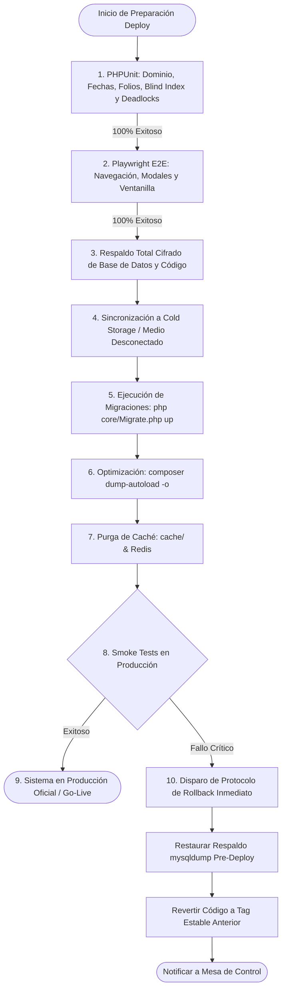

# Fase 5: Testing Automatizado, Verificación Integral, Go-Live, Respaldos Desconectados y Plan de Rollback

**Documento:** Plan de Implementación de Primer Despliegue — ERP DRC  
**Fase:** 5 de 5  
**Objetivo:** Validar la estabilidad funcional, criptográfica y de resiliencia mediante suites automatizadas (**PHPUnit 11** y **Playwright E2E**), ejecutar el protocolo formal de paso a producción (Go-Live Runbook), implementar una **estrategia de respaldos desconectados (Air-Gapped / Anti-Ransomware)** y garantizar planes de rollback en < 3 minutos.

---

## 1. Objetivos y Alcance de la Fase

1. **Ejecución de Pruebas Unitarias y de Integración (PHPUnit 11):** Cobertura exhaustiva sobre **Blind Index**, cálculo de fechas, generación atómica de folios, reintentos en Deadlocks y cambio de estado vital (`FINADO`).
2. **Pruebas de Extremo a Extremo (E2E Playwright):** Validación de flujos reales de usuario (login, emisión de turnos, captura de actas y descarga de reportes).
3. **Checklist de Smoke Tests Pre-Deploy (14 Puntos de Control):** Validación de seguridad perimetral, auditoría de lecturas (LGPDPPSO) y renderizado de grafías indígenas.
4. **Estrategia de Respaldos Desconectados (Cold Storage / Air-Gapped):** Protección de la base de datos como patrimonio civil mediante respaldos diarios cifrados con sincronización a medios aislados contra ataques de *ransomware*.
5. **Runbook de Go-Live Minuto a Minuto y Rollback Automatizado:** Procedimientos paso a paso para el pase a producción y restauración de emergencia.

---

## 2. Diagrama del Proceso de Despliegue y Respaldos Air-Gapped



---

## 3. Pruebas Automatizadas de Verificación (PHPUnit)

Ejecutar la suite en terminal:
```bash
vendor\bin\phpunit --testdox
```

### 3.1. Test de Blind Index e Inferencia Criptográfica
```php
<?php
// tests/Unit/EncryptionTest.php
namespace Tests\Unit;

use PHPUnit\Framework\TestCase;
use Core\Encryption;

class EncryptionTest extends TestCase {
    public function testBlindIndexYRandomIV() {
        $curp = "ABCD010101HDFRRN09";
        
        $bindex1 = Encryption::getBlindIndex($curp);
        $bindex2 = Encryption::getBlindIndex($curp);
        $this->assertEquals($bindex1, $bindex2, "El Blind Index debe ser determinista para permitir búsquedas exactas.");

        $cifrado1 = Encryption::encrypt($curp);
        $cifrado2 = Encryption::encrypt($curp);
        $this->assertNotEquals($cifrado1, $cifrado2, "Dos cifrados de la misma CURP deben tener ciphertexts diferentes (mitigación de inferencia).");

        $this->assertEquals($curp, Encryption::decrypt($cifrado1));
        $this->assertEquals($curp, Encryption::decrypt($cifrado2));
    }

    public function testFirmaDigitalHMAC() {
        $data = "NACIMIENTO_1025";
        $firma = Encryption::sign($data);
        $this->assertTrue(Encryption::verifySignature($data, $firma));
        $this->assertFalse(Encryption::verifySignature($data, "firma_alterada_invalida"));
    }
}
```

### 3.2. Test de Reintentos Automáticos ante Deadlock
```php
<?php
// tests/Unit/DeadlockRetryTest.php
namespace Tests\Unit;

use PHPUnit\Framework\TestCase;
use Core\Database;

class DeadlockRetryTest extends TestCase {
    public function testTransaccionConReintentosExitoso() {
        $intentos = 0;
        $resultado = Database::transactionWithRetry(function($pdo) use (&$intentos) {
            $intentos++;
            if ($intentos < 2) {
                throw new \PDOException("Deadlock found when trying to get lock; try restarting transaction", 1213);
            }
            return "TRANSACCION_COMPLETADA";
        }, 3);

        $this->assertEquals("TRANSACCION_COMPLETADA", $resultado);
        $this->assertEquals(2, $intentos, "La transacción debe recuperarse y reintentar automáticamente.");
    }
}
```

---

## 4. Checklist de Smoke Tests Pre-Deploy (14 Puntos de Control)

| # | Prueba de Humo | Acción | Resultado Esperado |
|---|---|---|:---:|
| 1 | **Aislamiento Perimetral** | Abrir `https://drc.gob.mx/.env` y `https://drc.gob.mx/core/Database.php` | `HTTP 403 Forbidden` |
| 2 | **Control de Acceso RBAC** | Iniciar con rol `OPERADOR` e intentar abrir `public/usuarios.php` | `HTTP 403 Forbidden` amigable |
| 3 | **Protección CSRF** | Enviar petición POST a `public/update_usuario.php` sin token | JSON con `Token CSRF inválido` |
| 4 | **Blind Index de CURP** | Buscar ciudadano por CURP en `modules/ciudadanos/search.php` | Búsqueda por `curp_bindex` instantánea |
| 5 | **Auditoría LGPDPPSO** | Consultar expediente de ciudadano | Se crea registro `tipo_evento = 'LECTURA'` |
| 6 | **Grafías Indígenas** | Capturar y ver ciudadano con nombre *Xóchitl Ta'an* | Renderizado perfecto sin corrupción de caracteres |
| 7 | **Actas PDF Unicode** | Generar Acta en PDF con nombre indígena | Caracteres nítidos con fuente `DejaVu Sans` |
| 8 | **Validador QR HMAC** | Abrir `public/validate.php?id=1&t=firma_falsa` | Rechazo por firma digital inválida |
| 9 | **Worker CLI & Reconexión** | Ejecutar Worker tras inactividad y solicitar exportación | Procesa trabajo sin error `MySQL has gone away` |
| 10 | **Permisos de Archivos Worker** | Descargar reporte generado en `public/exports/` | Descarga exitosa con permisos `0664` |
| 11 | **Folios Atómicos** | Emitir dos peticiones rápidas seguidas | Folios correlativos sin saltos |
| 12 | **Sesiones en Redis** | Verificar llaves activas en Redis (Socket o TCP) | `redis-cli keys "DRC_SESS_*"` muestra llaves |
| 13 | **Assets 100% Offline** | Cargar el dashboard sin conexión a Internet | UI, iconos y estilos intactos (0 errores 404) |
| 14 | **CSP sin unsafe-eval** | Abrir consola en modales con Alpine | 0 violaciones de CSP en consola |

---

## 5. Estrategia de Respaldos Fuera de Sitio (Air-Gapped / Anti-Ransomware)

Dado que las actas del Registro Civil constituyen patrimonio civil de seguridad nacional, se implementa un script de respaldo diario que cifra el volcado SQL con AES-256 antes de sincronizarlo a un medio físicamente aislado:

```bash
#!/bin/bash
# scripts/backup_airgapped.sh
FECHA=$(date +"%Y%m%d_%H%M%S")
BACKUP_DIR="/var/backups/drc"
ENCRYPTION_PASS="ClaveUltraSeguraDeRespaldoGobierno2026!"
SQL_FILE="$BACKUP_DIR/drc_erp_$FECHA.sql"
ENC_FILE="$BACKUP_DIR/drc_erp_$FECHA.sql.enc"

mkdir -p $BACKUP_DIR

echo "1. Generando volcado transaccional de MySQL..."
mysqldump -u root -p --single-transaction --routines --triggers drc_erp > $SQL_FILE

echo "2. Cifrando respaldo con AES-256-CBC..."
openssl enc -aes-256-cbc -salt -in $SQL_FILE -out $ENC_FILE -k "$ENCRYPTION_PASS" -pbkdf2
rm -f $SQL_FILE # Eliminar archivo plano sin cifrar

echo "3. Sincronizando a almacenamiento secundario / Cold Storage aislado..."
# Ejemplo: Copia a punto de montaje externo desconectable o NAS aislado
if [ -d "/mnt/cold_storage_drc" ]; then
    rsync -avz $ENC_FILE /mnt/cold_storage_drc/
    echo "[OK] Respaldo sincronizado a Cold Storage."
fi

# Retención local de 30 días
find $BACKUP_DIR -type f -name "*.enc" -mtime +30 -delete
echo "Respaldo completado exitosamente: $ENC_FILE"
```

---

## 6. Runbook de Go-Live Minuto a Minuto

| Momento | Responsable | Acción Operativa | Comando / Procedimiento |
|---|:---:|---|---|
| **T-60 min** | DevOps | Notificar inicio de ventana de mantenimiento. | Mostrar banner informativo a usuarios. |
| **T-45 min** | DBA | Generar respaldo total cifrado de BD. | `bash scripts/backup_airgapped.sh` |
| **T-30 min** | DevOps | Desplegar paquete de código fuente (`main`). | `git pull origin main` |
| **T-20 min** | Backend | Ejecutar migraciones versionadas. | `php core/Migrate.php up` |
| **T-15 min** | Backend | Congelar autoloader y purgar cachés. | `composer dump-autoload -o && rm -rf cache/*` |
| **T-10 min** | DevOps | Iniciar demonio de Worker CLI y Cron. | `sudo systemctl restart drc-worker.service` |
| **T-05 min** | QA / Lead | Ejecutar los 14 Smoke Tests en vivo. | Validación manual y automatizada. |
| **T-00 min** | Coordinador | **GO-LIVE OFICIAL:** Apertura a ventanillas. | Retirar banner de mantenimiento. |
| **T+60 min** | Lead | Monitoreo continuo de `auditoria_logs`. | Verificar bitácora de operaciones y errores. |

---

## 7. Plan de Contingencia y Rollback Automatizado

### Script de Rollback para Linux (`scripts/rollback.sh`)
```bash
#!/bin/bash
echo "=== INICIANDO PROTOCOLO DE ROLLBACK DE EMERGENCIA ==="

sudo systemctl stop apache2

echo "Restaurando base de datos pre-deploy..."
mysql -u root -p drc_erp < /var/backups/backup_predeploy.sql

echo "Revirtiendo código fuente..."
git reset --hard tags/v1.3.0
composer dump-autoload -o

rm -rf /var/www/DRC/cache/*
sudo systemctl restart redis-server
sudo systemctl restart drc-worker.service
sudo systemctl start apache2

echo "=== ROLLBACK COMPLETADO. SISTEMA RESTAURADO A v1.3.0 ==="
```

---

## 8. Checklist de Aceptación Final de la Fase 5

- [ ] Suite de pruebas unitarias (`vendor\bin\phpunit`) ejecutada con 100% de tests pasando en verde.
- [ ] Pruebas E2E de Playwright completadas exitosamente en navegador.
- [ ] Script `backup_airgapped.sh` probado y generando archivo `.sql.enc` cifrado.
- [ ] Los 14 Smoke Tests de la sección 4 ejecutados y aprobados en producción.
- [ ] Contraseña predeterminada de `admin@drc.gob.mx` actualizada.
- [ ] Servicio de Worker CLI activo y procesando trabajos con rotación de logs configurada.
- [ ] Bitácora de auditoría registrando lecturas (LGPDPPSO) y escrituras en tiempo real.
- [ ] Acta de pase a producción firmada por el Líder de Proyecto y el Responsable de Sistemas.
