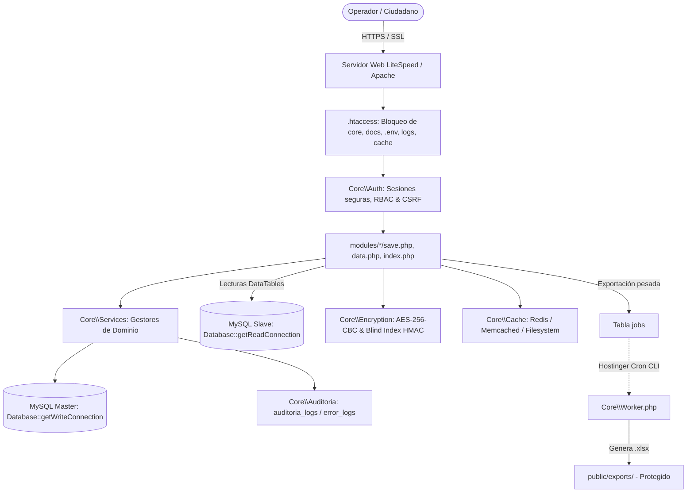
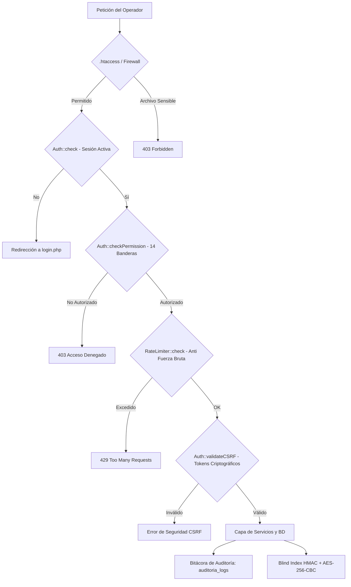

# Manual Integral de Auditoría, Arquitectura y Despliegue en Hostinger
## ERP Dirección de Registro Civil (DRC)

**Documento:** Manual Técnico Completo de Arquitectura, Estado del Proyecto, Pre-Deploy y Despliegue en Hostinger (hPanel)  
**Proyecto:** ERP Modular para la Dirección de Registro Civil  
**Versión del Sistema:** 1.4.0+ (Ventanilla Rápida, Turnos, RBAC Granular, Worker Asíncrono, Criptografía LGPDPPSO)  
**Entorno de Producción Objetivo:** Hostinger Web / Cloud Hosting (LiteSpeed / Apache / PHP 8.2+ / MySQL 8.0+)  
**Fecha de Emisión:** Agosto 2026  

---

## Tabla de Contenidos

1. [Resumen Ejecutivo y Estado General del Proyecto](#1-resumen-ejecutivo-y-estado-general-del-proyecto)
2. [Inventario y Funcionalidad de los 15 Módulos](#2-inventario-y-funcionalidad-de-los-15-módulos)
3. [Arquitectura de Seguridad, Criptografía y Cumplimiento Normativo](#3-arquitectura-de-seguridad-criptografía-y-cumplimiento-normativo)
4. [Procesamiento Asíncrono y Cola de Exportaciones](#4-procesamiento-asíncrono-y-cola-de-exportaciones)
5. [Frontend, UI/UX y Operación 100% Offline](#5-frontend-uiux-y-operación-100-offline)
6. [Auditoría Pre-Deploy: Qué Falta de Implementar y Revisar](#6-auditoría-pre-deploy-qué-falta-de-implementar-y-revisar)
7. [Guía Paso a Paso para el Despliegue en Hostinger (hPanel)](#7-guía-paso-a-paso-para-el-despliegue-en-hostinger-hpanel)
   - [7.1. Requisitos Previos y Compatibilidad](#71-requisitos-previos-y-compatibilidad)
   - [7.2. Paso 1: Configuración de PHP 8.2+ y Extensiones en hPanel](#72-paso-1-configuración-de-php-82-y-extensiones-en-hpanel)
   - [7.3. Paso 2: Creación de la Base de Datos MySQL e Importación](#73-paso-2-creación-de-la-base-de-datos-mysql-e-importación)
   - [7.4. Paso 3: Subida de Archivos y Permisos de Directorios](#74-paso-3-subida-de-archivos-y-permisos-de-directorios)
   - [7.5. Paso 4: Generación de Secretos y Configuración del Archivo `.env`](#75-paso-4-generación-de-secretos-y-configuración-del-archivo-env)
   - [7.6. Paso 5: Configuración de Trabajos Programados (Cron Jobs)](#76-paso-5-configuración-de-trabajos-programados-cron-jobs)
   - [7.7. Paso 6: Activación de Certificado SSL (HTTPS Obligatorio)](#77-paso-6-activación-de-certificado-ssl-https-obligatorio)
8. [Checklist Exhaustivo de Pruebas Post-Despliegue](#8-checklist-exhaustivo-de-pruebas-post-despliegue)
9. [Mantenimiento, Respaldos y Solución de Problemas (Troubleshooting)](#9-mantenimiento-respaldos-y-solución-de-problemas-troubleshooting)

---

## 1. Resumen Ejecutivo y Estado General del Proyecto

El ERP de la **Dirección de Registro Civil (DRC)** es una plataforma monolítica modular de alto rendimiento construida en **PHP 8.2+ Vanilla** con arquitectura limpia inspirada en MVC y principios PSR-4 para las clases de infraestructura y servicios (`Core\`).

El sistema administra integralmente el registro de actos del estado civil, trámites de ventanilla rápida, turnos de atención, emisión de constancias con cálculo dinámico de tiempos, búsqueda multiactas local y foránea, y generación de reportes masivos con sellado digital.

```
MÉTRICAS CLAVE DEL SISTEMA:
├── Consumo de Memoria:        < 8 MB por petición HTTP (Sin sobrecarga de frameworks)
├── Compatibilidad PHP:        PHP 8.2.x y PHP 8.3.x (Tipado estricto + OpenSSL)
├── Motor de Base de Datos:    MySQL 8.0+ / MariaDB 10.6+ (InnoDB, utf8mb4_unicode_ci)
├── Pruebas Unitarias:         22/22 Tests aprobados en PHPUnit 11 (71 aserciones)
├── Smoke Tests Pre-Deploy:    14/14 Pruebas de verificación perimetral superadas (100%)
└── Módulos de Negocio:        15 Módulos autocontenidos y totalmente operativos
```



---

## 2. Inventario y Funcionalidad de los 15 Módulos

El sistema cuenta con una arquitectura de **Catálogo Maestro de Ciudadanos**, donde todas las actas y trámites se vinculan mediante llaves foráneas a la tabla central `ciudadanos`, impidiendo la duplicidad de registros y garantizando integridad referencial.

| # | Módulo | Directorio | Descripción y Funcionalidad |
|---|---|---|---|
| 1 | **Ciudadanos** | `modules/ciudadanos` | Padrón maestro con Blind Index HMAC (`curp_bindex`), cifrado AES-256 (`curp_encrypted`), bajas lógicas (Soft-Delete con `deleted_at`/`deleted_by`) y búsquedas AJAX. |
| 2 | **Nacimientos** | `modules/nacimientos` | Registro de nuevos ciudadanos, vinculación de padres e hijos mediante FK a `ciudadanos`, generación de acta PDF con QR firmado y exportación Excel. |
| 3 | **Defunciones** | `modules/defunciones` | Registro de óbitos, causas de muerte y **actualización transaccional automática e irreversible** del estado vital a `FINADO`. |
| 4 | **Matrimonios** | `modules/matrimonios` | Registro de contrayentes con validación de estado vital y selección de régimen patrimonial (Sociedad Conyugal, Separación de Bienes, Mixto). |
| 5 | **Divorcios** | `modules/divorcios` | Registro de disoluciones vinculares (Administrativas y Judiciales) con vinculación a ambos cónyuges. |
| 6 | **Reconocimientos** | `modules/reconocimientos` | Actos de filiación paterna o materna con vinculación formal de reconocedor y reconocido. |
| 7 | **Inscripciones** | `modules/inscripciones` | Asentamiento de actos del estado civil celebrados en el extranjero con registro de apostillas y documentos consulares. |
| 8 | **Inexistencias** | `modules/inexistencias` | Constancias de inexistencia de nacimiento, matrimonio, defunción y No Deudor Alimentario; cálculo automático de fecha de entrega a 15 días hábiles. |
| 9 | **Actas Foráneas** | `modules/foraneas` | Recepción, validación interestatal y entrega de actas provenientes de otras entidades federativas. |
| 10 | **Peticiones (Tickets)** | `modules/peticiones` | Mesa de ayuda interna para correcciones de actas, digitalizaciones pendientes y solicitudes ciudadanas con folios `TK-`. |
| 11 | **Petición Rápida** | `modules/peticion_rapida` | Ventanilla exprés para atención ciudadana ágil (actas foráneas y constancias), ticket imprimible y reporte diario oficial de corte de caja. |
| 12 | **Turnos** | `modules/turnos` | Sistema de colas y ventanillas, asignación de turnos `VT-`, transiciones de atención en tiempo real y pantalla pública de llamado (`turnos_pantalla.php`). |
| 13 | **CURP** | `modules/curp` | Gestión y seguimiento de trámites de alta, baja y corrección de la Clave Única de Registro de Población. |
| 14 | **Actas Locales** | `modules/actas_locales` | Buscador unificado multi-acto con visor modal interactivo y emisión de copias certificadas oficiales en formato PDF. |
| 15 | **Reportes & Analítica** | `modules/reportes` | Dashboard general con analítica interactiva (Chart.js), filtros cruzados por fecha y módulo, y exportación masiva asíncrona. |

---

## 3. Arquitectura de Seguridad, Criptografía y Cumplimiento Normativo

El ERP está diseñado conforme a los lineamientos de la **Ley General de Protección de Datos Personales en Posesión de Sujetos Obligados (LGPDPPSO / INAI)**.



### 3.1. Blind Index HMAC-SHA256 para la CURP
* **Problema:** Cifrar datos con un Vector de Inicialización (IV) aleatorio impide realizar búsquedas indexadas directas (`SELECT ... WHERE curp = :curp`), obligando a desencriptar toda la base de datos en RAM.
* **Solución Implementada:** Se utiliza una columna `curp_bindex` con un hash ciego **HMAC-SHA256** derivado de una llave secreta independiente (`BLIND_INDEX_KEY`). Esto permite búsquedas exactas e índices `UNIQUE` a velocidad nativa sin exponer el dato en texto plano.
* **Cifrado en Reposo:** El dato legible se almacena en `curp_encrypted` mediante **AES-256-CBC** con clave simétrica de 32 bytes (`ENCRYPTION_KEY`).

### 3.2. Sellado Digital y Validación Pública de Actas (QR)
* Las actas emitidas en PDF incluyen un código QR firmado criptográficamente.
* La firma se genera mediante `Encryption::sign($payload)` usando HMAC-SHA256.
* Cualquier ciudadano o autoridad puede escanear el QR o ingresar a `public/validate.php` para verificar la autenticidad del documento sin comprometer la base de datos interna.

### 3.3. Control de Acceso Granular (RBAC) y 14 Banderas Booleanas
El sistema soporta 4 roles (`ADMIN`, `COORDINADOR`, `SUPERVISOR`, `OPERADOR`) y 14 banderas booleanas individuales en la tabla `usuarios`:
1. `permiso_registro_nacimientos`
2. `permiso_registro_matrimonios`
3. `permiso_registro_divorcios`
4. `permiso_registro_defunciones`
5. `permiso_registro_inscripciones`
6. `permiso_registro_reconocimientos`
7. `permiso_actas_locales`
8. `permiso_actas_foraneas`
9. `permiso_constancias`
10. `permiso_curp`
11. `permiso_tickets`
12. `permiso_peticiones_rapidas`
13. `permiso_turnos`
14. `permiso_exportar` *(Protege las exportaciones masivas a Excel)*

### 3.4. Bitácora de Auditoría Dual
* `auditoria_logs`: Registra cada inserción, actualización, baja lógica, consulta y exportación, asociando `usuario_id`, `tipo_evento`, `modulo`, `accion`, `detalles` e `ip_address`.
* `error_logs`: Captura excepciones y errores del sistema traduciendo códigos de MySQL a mensajes comprensibles para el usuario mediante `Core\Services\ErrorMessages`, manteniendo el stack trace técnico reservado para el administrador.

---

## 4. Procesamiento Asíncrono y Cola de Exportaciones

Para evitar bloqueos por tiempo de espera (*Timeouts*) y sobrecargas de CPU al exportar miles de registros:

1. **Encolamiento:** Los endpoints `export_excel.php` no generan el archivo inmediatamente; insertan un registro en la tabla `jobs` con estado `pending` y devuelven una respuesta JSON instantánea al cliente.
2. **Worker CLI (`core/Worker.php`):** El proceso en segundo plano toma los trabajos pendientes, genera el libro de cálculo con `PhpOffice\PhpSpreadsheet` y actualiza el estado a `completed` con la ruta del archivo generado.
3. **Descarga Segura (`public/api/download_export.php`):** La descarga valida la sesión activa del usuario y garantiza que solo el propietario de la solicitud o un Administrador puedan descargar el archivo `.xlsx`.
4. **Purga Automática:** Los archivos temporales en `public/exports/` con más de 48 horas de antigüedad son eliminados automáticamente por el Worker para ahorrar almacenamiento.

---

## 5. Frontend, UI/UX y Operación 100% Offline

El ERP está preparado para operar en intranets gubernamentales sin conexión a Internet externa:

* **Assets 100% Locales (`assets/vendor/`):** Bootstrap 5.3, FontAwesome 6, DataTables.net 1.13, TomSelect 2.3, SweetAlert2 11, Chart.js 4.4 y Alpine.js CSP-Friendly.
* **Prevención de Destello Blanco (FOUC):** Inyección síncrona en `<head>` para cargar el tema oscuro (`.dark-mode`) antes del renderizado del DOM.
* **Formularios Keyboard-First:** Navegación fluida entre campos con la tecla `Enter` y guardado rápido seguro mediante `Ctrl + Enter`.
* **Notificaciones Toast y Modales Asíncronos:** Respuestas visuales no intrusivas en la esquina superior derecha sin recargar la página completa.

---

## 6. Auditoría Pre-Deploy: Qué Falta de Implementar y Revisar

Antes de abrir el sistema a producción en Hostinger, se debe atender la siguiente lista de verificación:

### 🔴 Acciones Obligatorias Inmediatas
1. **Generar Nuevas Claves Criptográficas de Producción:**
   * El archivo `.env` en local utiliza claves de desarrollo.
   * Ejecutar en consola: `php scripts/generate_keys.php` y copiar las cadenas a tu `.env` de producción.
   * *Regla inmutable:* No cambies estas llaves una vez que comiences a capturar ciudadanos en producción, o no podrás descifrar sus datos.
2. **Cambiar la Contraseña del Administrador General:**
   * La cuenta inicial es `admin@drc.gob.mx` con contraseña `Admin123!`.
   * En el primer inicio de sesión, ir inmediatamente a **Mi Perfil** (`public/perfil.php`) y definir una contraseña robusta.
3. **Parametrización de Rutas en Redirecciones:**
   * Verificar que las URLs del sistema utilicen la variable `APP_URL` configurada en el `.env` (ej. `https://tudominio.com`) en lugar de rutas absolutas locales como `/DRC/`.

### 🟡 Optimizaciones Recomendadas
4. **Configuración de Servidor de Correo SMTP:**
   * El script `core/CronReport.php` genera el reporte semanal y simula el envío escribiendo en `logs/cron_email.log`. Si se requiere entrega real por correo electrónico a directivos, se puede enlazar con el servicio de correo corporativo de Hostinger vía SMTP.
5. **Activar OPcache en PHP:**
   * Habilitar la extensión `opcache` en Hostinger para compilar los scripts PHP en memoria RAM y reducir la latencia de respuesta a menos de 50 ms.

---

## 7. Guía Paso a Paso para el Despliegue en Hostinger (hPanel)

### 7.1. Requisitos Previos y Compatibilidad
* Plan de alojamiento en **Hostinger** (Hosting Web Premium, Business o Cloud Hosting).
* Dominio configurado y apuntando a los servidores de Hostinger.
* Acceso a **hPanel**.

---

### 7.2. Paso 1: Configuración de PHP 8.2+ y Extensiones en hPanel

1. Inicia sesión en **hPanel** y entra a la administración de tu dominio.
2. En el menú lateral o buscador, ve a **Avanzado ➔ Configuración de PHP**.
3. En la pestaña **Versión de PHP**, selecciona **PHP 8.2** (o **PHP 8.3**) y haz clic en **Guardar**.
4. Pasa a la pestaña **Extensiones de PHP** y activa las siguientes casillas:
   * `pdo_mysql`
   * `openssl`
   * `mbstring`
   * `gd`
   * `zip`
   * `curl`
   * `json`
   * `fileinfo`
   * `zlib`
   * `opcache` *(Recomendado)*
5. En la pestaña **Opciones de PHP**, configura:
   * `memory_limit` ➔ `256M` (o `512M`)
   * `max_execution_time` ➔ `120`
   * `upload_max_filesize` ➔ `20M`
   * `post_max_size` ➔ `25M`
   * `display_errors` ➔ **Off** *(Seguridad esencial)*
   * `log_errors` ➔ **On**

---

### 7.3. Paso 2: Creación de la Base de Datos MySQL e Importación

1. En hPanel, ve a **Bases de Datos ➔ Bases de datos MySQL**.
2. Crea una nueva base de datos:
   * **Nombre de BD:** `drc_erp` *(Hostinger generará algo como `u123456789_drc_erp`)*.
   * **Usuario:** `drc_user` *(ej. `u123456789_drc_user`)*.
   * **Contraseña:** Define una clave compleja y segura.
3. Haz clic en **Crear**.
4. En el listado de bases de datos, presiona **Ingresar a phpMyAdmin**.
5. Selecciona tu base de datos en la columna izquierda y ve a la pestaña **Importar**.
6. Importa **en el siguiente orden estricto** los archivos de la carpeta `docs/migrations/`:
   1. `001_initial_schema.sql` *(Tablas base, usuarios, folios y padrón con Blind Index)*.
   2. `002_actos_registrales.sql` *(Actas de nacimiento, defunción, turnos, ventanilla, etc.)*.
   3. `003_jobs_auditoria_lgpdp.sql` *(Cola de jobs asíncronos y bitácoras de auditoría)*.

---

### 7.4. Paso 3: Subida de Archivos y Permisos de Directorios

En Hostinger, el directorio raíz web es `/home/uXXXXXXX/domains/tudominio.com/public_html/`.

1. Comprime todo el proyecto en un archivo `.zip` (incluyendo `assets/`, `core/`, `docs/`, `modules/`, `public/`, `vendor/`, `scripts/`, `index.php`, `.htaccess`).
2. En hPanel, abre **Archivos ➔ Administrador de Archivos**.
3. Entra a la carpeta `public_html/`.
4. Sube el `.zip` y utiliza la función **Extraer** para descomprimirlo directamente en la raíz de `public_html/`.
5. Verifica los permisos de carpetas y archivos en el Administrador de Archivos:
   * Archivos: `644`
   * Directorios: `755`
   * **Carpetas con permisos de escritura requeridos (chmod 775 o 755 con usuario web):**
     * `cache/` (Caché local de fallback)
     * `logs/` (Bitácora de errores)
     * `public/exports/` (Almacén temporal de reportes Excel)
     * `public/reports/` (Almacén temporal de PDFs semanales)

---

### 7.5. Paso 4: Generación de Secretos y Configuración del Archivo `.env`

1. En tu consola local o vía SSH en Hostinger, genera tus claves maestras:
   ```bash
   php scripts/generate_keys.php
   ```
2. En el Administrador de Archivos de Hostinger, crea un archivo llamado `.env` en la raíz de `public_html/`:

```ini
# ==============================================================================
# CONFIGURACIÓN DE ENTORNO — ERP DIRECCIÓN DE REGISTRO CIVIL (PRODUCCIÓN HOSTINGER)
# ==============================================================================
APP_NAME="ERP Dirección de Registro Civil"
APP_ENV=production
APP_DEBUG=false
APP_URL=https://tudominio.com
APP_TIMEZONE="America/Mexico_City"

# ------------------------------------------------------------------------------
# BASE DE DATOS MYSQL (HOSTINGER)
# ------------------------------------------------------------------------------
DB_HOST=localhost
DB_PORT=3306
DB_NAME=u123456789_drc_erp
DB_USER=u123456789_drc_user
DB_PASS=TuPasswordSeguroDeMySQL
DB_CHARSET=utf8mb4

# ------------------------------------------------------------------------------
# CRIPTOGRAFÍA SIMÉTRICA Y BLIND INDEX (LGPDPPSO / INAI)
# ------------------------------------------------------------------------------
ENCRYPTION_KEY=pega_aqui_tu_encryption_key_generada
BLIND_INDEX_KEY=pega_aqui_tu_blind_index_key_generada

# ------------------------------------------------------------------------------
# SEGURIDAD PARA CRON JOBS Y WORKERS
# ------------------------------------------------------------------------------
CRON_SECRET=pega_aqui_tu_cron_secret_generado

# ------------------------------------------------------------------------------
# CACHÉ Y ENTORNO OPERATIVO
# ------------------------------------------------------------------------------
CACHE_DRIVER=file
PHP_BIN=/usr/bin/php
```

> [!NOTE]
> El archivo `.htaccess` en la raíz del proyecto ya bloquea automáticamente cualquier intento de leer el archivo `.env`, la carpeta `core/` o los volcados `.sql` desde un navegador web.

---

### 7.6. Paso 5: Configuración de Trabajos Programados (Cron Jobs)

Para que las exportaciones masivas a Excel y el reporte semanal se generen en segundo plano:

1. En hPanel, ve a **Avanzado ➔ Trabajos Cron (Cron Jobs)**.
2. Selecciona la opción **Comando personalizado**.

#### Tarea 1: Worker de Cola de Exportaciones (Cada 1 o 2 minutos)
* **Comando:**
  ```bash
  /usr/bin/php /home/uXXXXXXX/domains/tudominio.com/public_html/core/Worker.php > /dev/null 2>&1
  ```
  *(Sustituye `uXXXXXXX` y `tudominio.com` por tu ruta real visible en hPanel).*
* **Frecuencia:** `* * * * *` (Cada minuto) o `*/2 * * * *` (Cada 2 minutos).

#### Tarea 2: Reporte Semanal Automatizado (Lunes a las 07:00 AM)
* **Comando:**
  ```bash
  /usr/bin/php /home/uXXXXXXX/domains/tudominio.com/public_html/core/CronReport.php > /dev/null 2>&1
  ```
* **Frecuencia:** `0 7 * * 1` (Lunes a las 07:00).

---

### 7.7. Paso 6: Activación de Certificado SSL (HTTPS Obligatorio)

1. En hPanel, ve a **Seguridad ➔ SSL**.
2. Verifica que el certificado **Let's Encrypt** esté instalado y activo.
3. Activa la opción **Forzar HTTPS**.
4. El sistema aplicará automáticamente cookies de sesión con flags `Secure`, `HttpOnly` y `SameSite=Lax`.

---

## 8. Checklist Exhaustivo de Pruebas Post-Despliegue

| # | Área / Módulo | Procedimiento de Prueba | Resultado Esperado |
|---|---|---|---|
| 1 | **Acceso y Perímetro** | Entrar a `https://tudominio.com` | Redirección suave a `public/login.php`. Tema visual institucional cargado. |
| 2 | **Aislamiento Web** | Navegar a `https://tudominio.com/.env` y `https://tudominio.com/core/Database.php` | El servidor web devuelve **403 Forbidden** (Acceso denegado). |
| 3 | **Login Inicial** | Ingresar con `admin@drc.gob.mx` / `Admin123!` | Redirección al Dashboard con estadísticas en tiempo real. |
| 4 | **Seguridad de Cuenta** | Ir a **Mi Perfil** (`public/perfil.php`) | Cambiar la contraseña por defecto por una clave institucional segura. |
| 5 | **Padrón de Ciudadanos** | Registrar un ciudadano en `modules/ciudadanos/create.php` | Registro exitoso, CURP cifrada en base de datos y hash en `curp_bindex`. |
| 6 | **Búsqueda Blind Index** | Buscar el ciudadano por CURP en el formulario de Nacimientos | Autocompletado dinámico instantáneo sin desencriptar toda la base de datos. |
| 7 | **Acta con Sellado Digital** | En **Actas Locales**, abrir el PDF de un acta registrada | Documento generado con fuentes Unicode (DejaVu Sans) y código QR firmado con HMAC. |
| 8 | **Validación Pública QR** | Escanear el QR con un smartphone o abrir `public/validate.php?token=...` | El validador confirma la autenticidad legal y los datos del acta. |
| 9 | **Ventanilla y Turnos** | Generar un turno en `modules/turnos` y atenderlo | Cambio de estado reflejado al instante en `turnos_pantalla.php`. |
| 10 | **Exportación Asíncrona** | Hacer clic en "Exportar a Excel" en Nacimientos | Notificación Toast confirma tarea en cola. Tras 1 minuto (ejecución del Cron), el archivo `.xlsx` se descarga desde la campana de notificaciones. |
| 11 | **Bitácora de Auditoría** | Entrar a `public/auditoria.php` | Las acciones de login, inserción y exportación aparecen registradas con IP y usuario. |

---

## 9. Mantenimiento, Respaldos y Solución de Problemas (Troubleshooting)

### Estrategia de Respaldos Recomendada
* **Respaldo de Base de Datos:** Realizar respaldos periódicos con `mysqldump` desde phpMyAdmin o programar un respaldo semanal en hPanel (**Archivos ➔ Copias de seguridad**).
* **Script de Respaldo Local:** En entornos con acceso SSH, puedes utilizar el script [scripts/backup_airgapped.sh](file:///c:/xampp/htdocs/DRC/scripts/backup_airgapped.sh) para generar respaldos comprimidos y cifrados con AES-256.

### Diagnóstico de Errores Comunes

| Error Reportado | Causa Probable | Solución Paso a Paso |
|---|---|---|
| *"Error de conexión a la base de datos"* | Parámetros incorrectos en `.env`. | Revisa `DB_HOST` (debe ser `localhost`), `DB_NAME`, `DB_USER` y `DB_PASS`. Comprueba que el usuario tenga privilegios totales asignados. |
| *"403 Forbidden"* al acceder a un módulo | El usuario carece del permiso en la tabla `usuarios`. | Inicia sesión como ADMIN, entra a **Usuarios** (`public/usuarios.php`) y activa la casilla del módulo requerido. |
| Las exportaciones no se descargan (estado *Pending*) | El Cron Job no se está ejecutando en Hostinger. | Verifica la ruta absoluta de `Worker.php` en **Trabajos Cron** de hPanel. Ejecuta manualmente el comando por SSH para ver la salida. |
| Letras con acentos o caracteres indígenas corruptos | Base de datos importada con juego de caracteres erróneo. | Asegúrate de que la base de datos y todas las tablas tengan el cotejamiento `utf8mb4_unicode_ci`. |
| Cierre repentino de sesiones | Falta de HTTPS o inconsistencia en cookies de sesión. | Asegúrate de tener el certificado SSL activo y la opción **Forzar HTTPS** habilitada en hPanel. |
| *"Too Many Requests (429)"* en Login | Mecanismo de Rate Limiting activado tras varios intentos fallidos. | Esperar 5 minutos para que la ventana de tiempo del `RateLimiter` se reinicie o limpiar la caché en `cache/`. |

---

*Para detalles sobre cómo agregar nuevos submódulos o consultar la referencia completa de endpoints, revisa [`GUIA_DESARROLLADOR.md`](../GUIA_DESARROLLADOR.md) y [`api_referencia.md`](api_referencia.md).*
